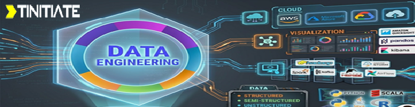
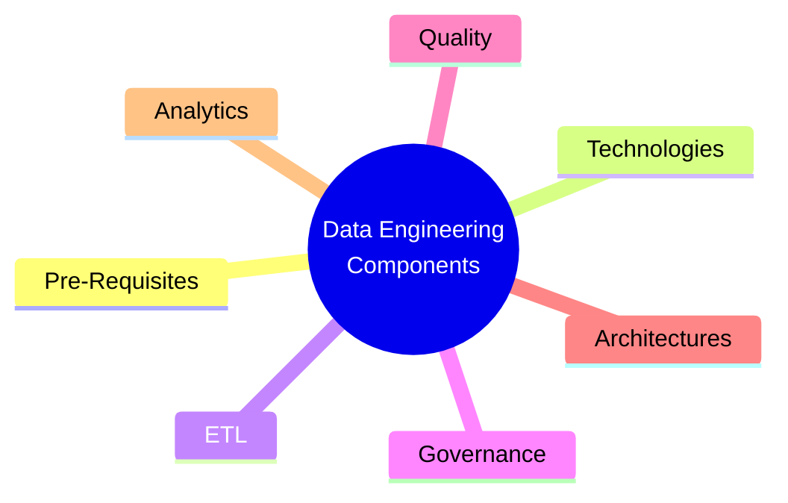

# Tinitiate Data Engineering
> Tinitiate.com / Venkata Bhattaram / Jay Kumsi

## [Introduction to Data Engineering](introduction.md)
## [Objectives](objectives.md)

## Components of Data Engineering

Technical components of Data Engineering describe the pieces you assemble during different project phases. The following sections help you identify prerequisites, choose a technology stack, and understand how each component fits into the lifecycle.

* 📝 [Prerequisites](pre-requsites.md)
* 🧩 [Technology Stacks](tech-stacks.md)
* [Data Analytics with AI](data-analytics-ai.md)
* [Data Analytics with ML](data-analytics-ml.md)

* [ETL]()
* [Data Governence]()
* [Data Lineage]()
* [Data Quality]()
* [Medallion Data Architecture]()
* [Data Lake]()
* [Lake House]()
* [Data Mesh]()
* [Data Fabric]()
* [Reporting]()
* [Data Analytics]()
* [MDM - Master Data Management]()
  
## Data Engineering with OnPrem Technologies
## Data Engineering with AWS
## Data Engineering with Azure
## Data Engineering with GCP
## Data Engineering with Snowflake
## Data Engineering with Data Bricks
## Data Engineering with DBT

