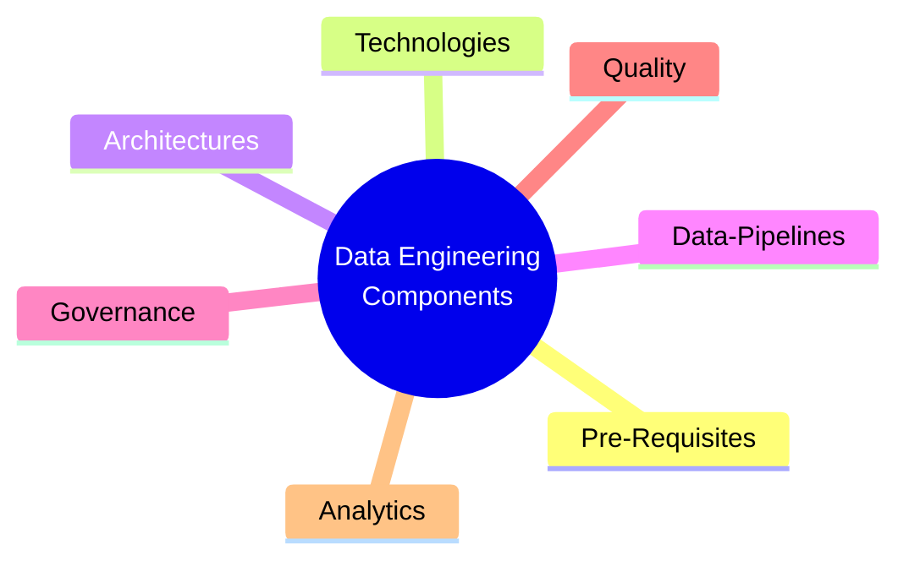

# Tinitiate Data Engineering
> Tinitiate.com / Venkata Bhattaram / Jay Kumsi

## 📋 Overview & Navigation
Start here to explore the data engineering curriculum and supporting resources.

* 📘 [Introduction to Data Engineering](introduction.md)
* 🎯 [Objectives](objectives.md)
* 📝 [Prerequisites](pre-requsites.md)
* 🧩 [Technology Stacks](tech-stacks.md)

## 🏗️ Architectural Patterns
Explore foundational architectures used to build modern data platforms.
* [Medallion Data Architecture](medallion-architecture.md)
* [Data Warehouse](data-warehouse.md)
* [Star and Snowflake Schema](star-snowflake.md)
* [Data Lake](data-lake.md)
* [Data Pipelines](data-pipelines.md)
* [Lake House](lake-house.md)
* [Data Mesh](data-mesh.md)
* [Data Fabric](data-fabrick.md)

## 🧱 Data Engineering Layers
Sections describe logical stages in a data pipeline.
* [ETL](etl.md)
* [ELT](elt.md)

* [Staging / Landing Zone](staging.md)
* [Operational Data Store](ods.md)

## 📜 Governance & Compliance
* [Data Governance](data-governance.md)
* [Data Lineage](data-lineage.md)
* [Data Quality](data-quality.md)
* [MDM - Master Data Management](mdm.md)

## 📊 Reporting & Advanced Analytics
* [Reporting](reporting.md)
* [Data Analytics](data-analytics.md)
* [Data Analytics with AI](data-analytics-ai.md)
* [Data Analytics with ML](data-analytics-ml.md)
  
## Data Engineering with OnPrem Technologies
## Data Engineering with AWS
## Data Engineering with Azure
## Data Engineering with GCP
## Data Engineering with Snowflake
## Data Engineering with Data Bricks
## Data Engineering with DBT

