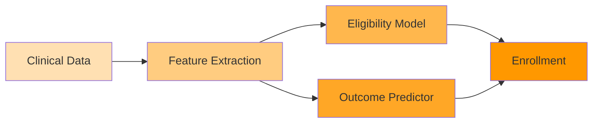
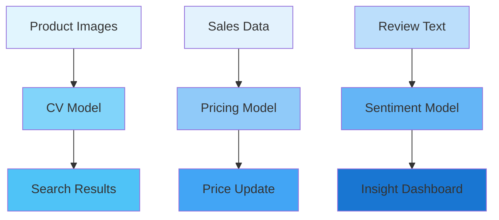
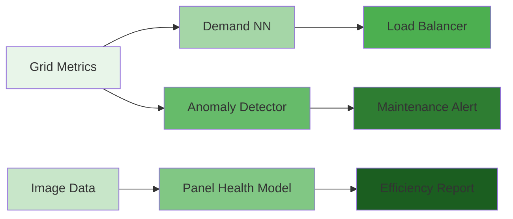
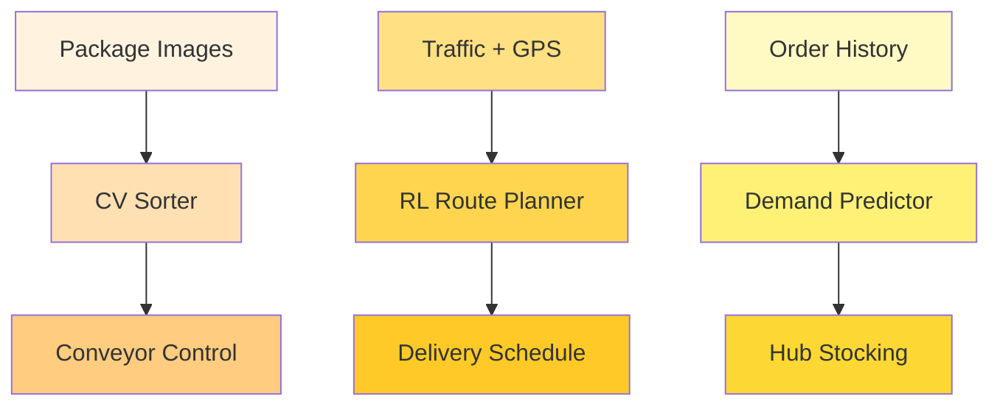
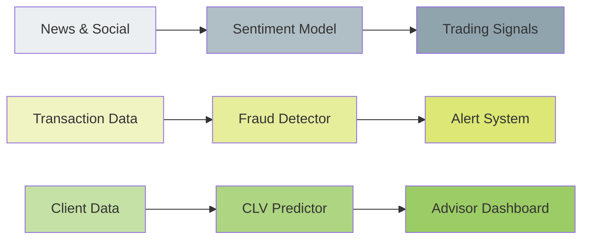
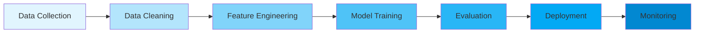
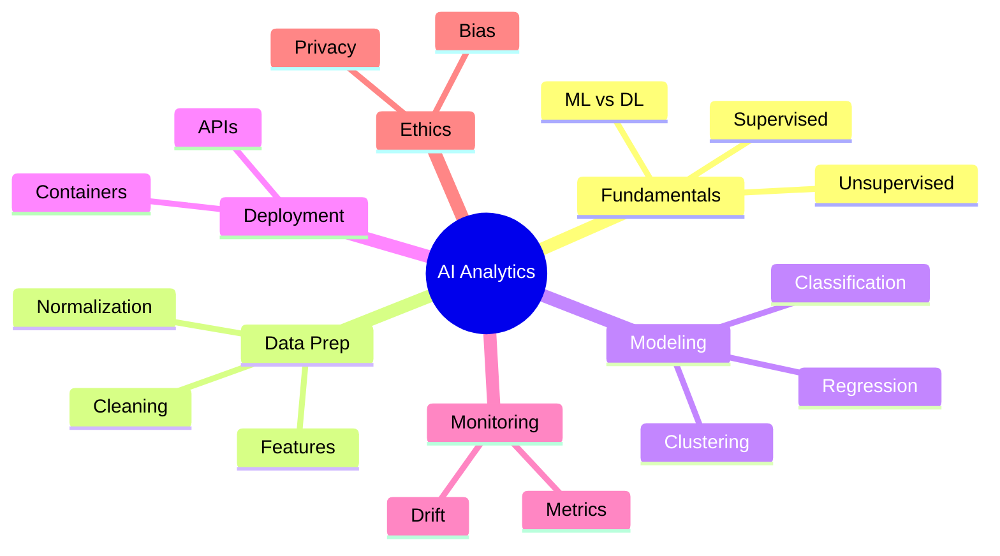

# Data Analytics with AI

This module explores how artificial intelligence enhances data analytics, unlocking predictive and prescriptive insights. It covers the full lifecycle from data preparation to deploying intelligent models and interpreting results.

## Key Components
- 🤖 **AI Fundamentals**: Understanding machine learning vs. deep learning, supervised/unsupervised learning
- 🔬 **Data Preparation**: Feature engineering, handling missing values, normalization
- 📊 **Model Training**: Selecting algorithms (regression, classification, clustering), hyperparameter tuning
- 🚀 **Deployment**: Serving models via APIs, containerization, serverless inference
- 📈 **Monitoring & Feedback**: Tracking accuracy, drift detection, retraining pipelines
- 🧠 **Explainability**: Interpreting model decisions, SHAP/LIME
- 🔐 **Ethics & Bias**: Responsible AI practices, fairness, privacy

## Industry Use Cases

### 🏥 Pharmaceutical & Clinical Trials
- **Sub-projects**:
  * Automated patient eligibility screening
  * Predictive modeling for trial outcomes
  * AI-driven imaging analysis for diagnostic support
- **Description**: AI models process EHRs, genomic data, and imaging to select trial participants, simulate outcomes, and detect anomalies in medical scans. This reduces trial duration and improves safety.
- **Flow**:

### 🛍️ Retail
- **Sub-projects**:
  * Visual search using computer vision
  * Dynamic pricing optimization
  * Customer sentiment analysis from reviews
- **Description**: Deep learning analyzes image and text data for visual search, optimizes prices based on demand patterns, and interprets customer feedback to improve offerings.
- **Flow**:

### ⚡ Energy
- **Sub-projects**:
  * Smart grid demand prediction with neural networks
  * Fault detection in transmission lines via anomaly detection
  * AI-based solar panel efficiency monitoring
- **Description**: Neural networks forecast demand spikes, unsupervised models spot irregular patterns suggesting equipment failure, and image analytics assess panel health.
- **Flow**:

### 🚚 Logistics
- **Sub-projects**:
  * Automated warehouse sorting with computer vision
  * AI-assisted route planning under traffic variability
  * Demand prediction for last-mile delivery
- **Description**: Vision models classify and sort packages, reinforcement learning plans routes adapting to real-time conditions, and prediction models ensure adequate stock in local hubs.
- **Flow**:

### 💰 Finance – Investment Banking & Wealth Management
- **Sub-projects**:
  * AI-driven market sentiment analysis using NLP
  * Robo-advisors providing investment recommendations
  * Fraud detection in high-value transactions
  * Customer lifetime value prediction for wealth clients
- **Description**: NLP scans news and social media to gauge sentiment; reinforcement learning models trade assets; anomaly detection protects against fraud; predictive analytics personalize wealth advice.
- **Flow**:

## Flow Diagram

## Mind Map

## Practical Tips
- Use cross-validation for reliable performance estimates
- Automate retraining when new data arrives
- Leverage pre-trained models for image/text analytics
- Document data lineage for auditability

> This section equips learners to build AI-powered analytics systems that scale and remain trustworthy.