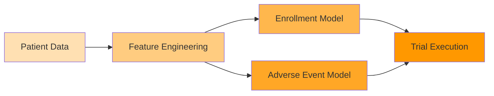
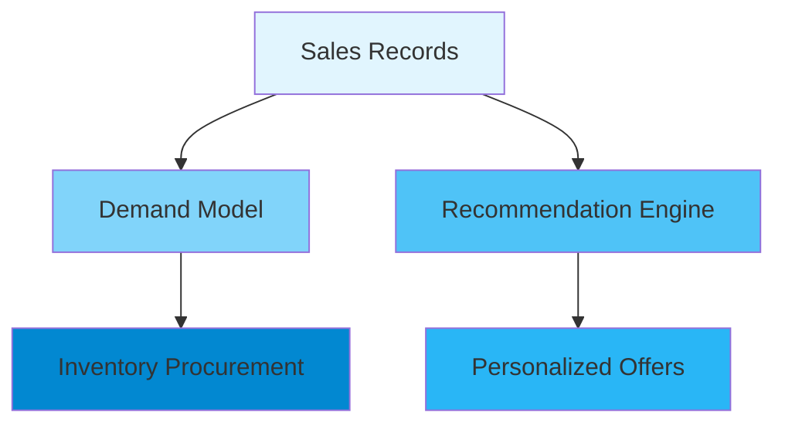
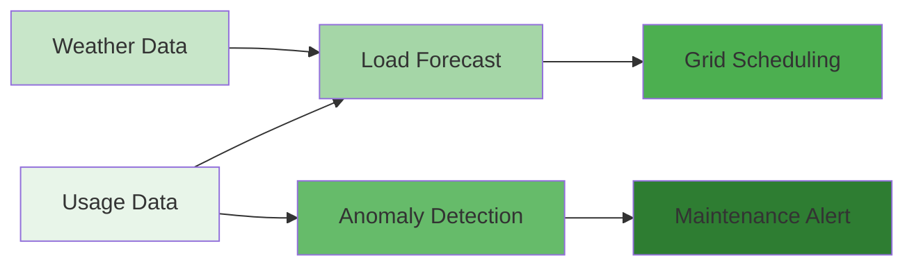
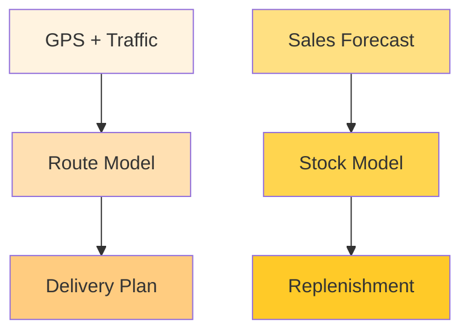
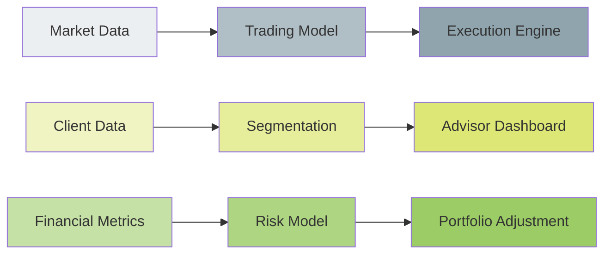
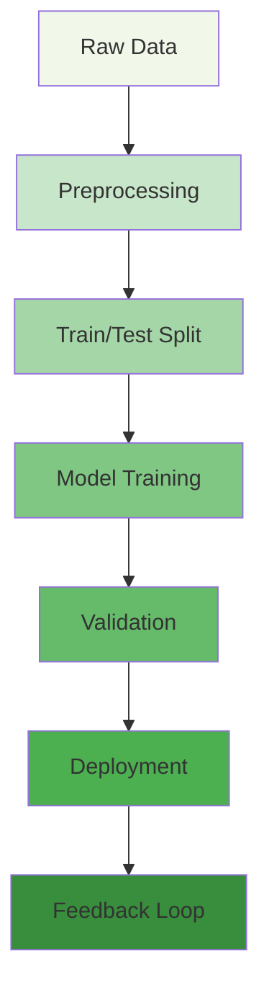
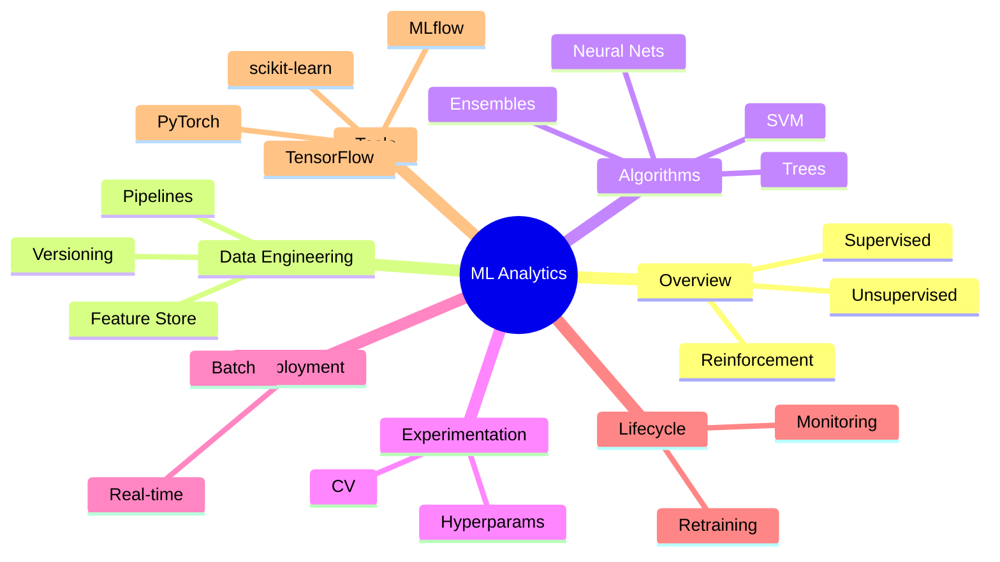

# Data Analytics with Machine Learning

Machine learning (ML) is a core enabler of sophisticated analytics. This section focuses on applying ML techniques to extract patterns and build predictive models from data.

## Core Topics
- 📚 **ML Overview**: Types of learning, key algorithms, evaluation metrics
- 🏗️ **Data Engineering for ML**: Pipeline design, feature stores, data versioning
- ⚙️ **Model Selection**: Decision trees, SVMs, neural networks, ensemble methods
- 🧪 **Experimentation**: A/B testing, cross-validation, hyperparameter search
- 🚢 **Model Operations**: Deployment strategies, batch vs real-time inference
- 🔄 **Model Lifecycle**: Monitoring performance, detecting drift, retraining
- 📦 **Tools & Frameworks**: scikit-learn, TensorFlow, PyTorch, MLflow

## Real-World Examples

### 🏥 Pharmaceutical & Clinical Trials
- **Sub-projects**:
  * Patient stratification for trial enrollment
  * Adverse event prediction using survival analysis
  * Dose optimization models
- **Description**: ML models analyze historical trial data to identify patient cohorts most likely to respond, predict side effects, and suggest optimal dosing. Real-time monitoring streams from EHRs feed risk models.
- **Flow**:

### 🛍️ Retail
- **Sub-projects**:
  * Inventory demand forecasting
  * Personalized offers based on purchase history
  * Store layout optimization using customer movement data
- **Description**: Predictive models use sales and sensor data to forecast inventory needs, recommend items, and design efficient store layouts.
- **Flow**:

### ⚡ Energy
- **Sub-projects**:
  * Load forecasting for grid management
  * Predictive maintenance of turbines and transformers
  * Renewable production prediction (solar/wind)
- **Description**: Time-series models forecast consumption while anomaly detection flags equipment issues; combined with weather data to predict renewable output.
- **Flow**:

### 🚚 Logistics
- **Sub-projects**:
  * Route optimization for delivery fleets
  * Demand prediction for distribution centers
  * Inventory replenishment models
- **Description**: Models combine GPS, traffic, and historical demand to plan efficient routes and stock levels.
- **Flow**:

### 💰 Finance – Investment Banking & Wealth Management
- **Sub-projects**:
  * Algorithmic trading strategies
  * Portfolio risk modeling
  * Client segmentation for wealth advisors
  * Credit risk assessment for investment loans
- **Description**: High-frequency data drives trading algorithms; ML estimates risk/return profiles and segments clients for targeted advice.
- **Flow**:

## Pipeline Flow

## Mind Map

## Best Practices
- Maintain a separate feature store to avoid data leakage
- Keep experiments reproducible using tooling (e.g., MLflow)
- Monitor model performance in production and set alerts for degradation
- Use automated pipelines to retrain models with fresh data

> With this knowledge, learners can architect, build, and manage ML-driven analytics solutions effectively.