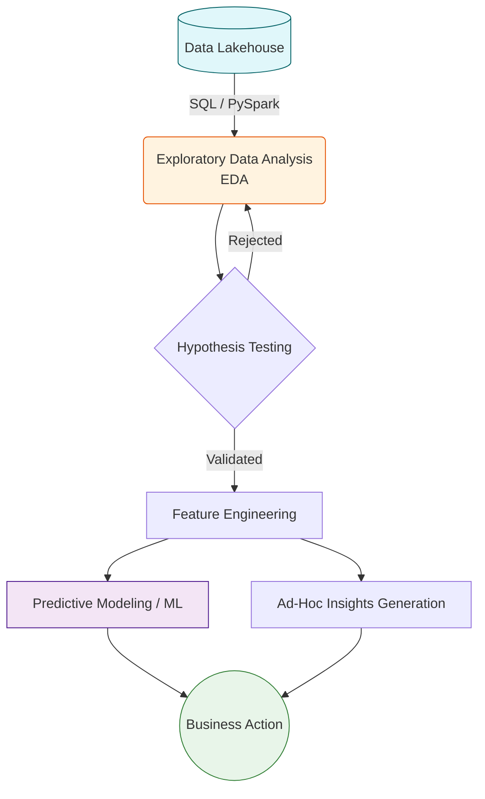

# 📈 Data Analytics

**Data Analytics** is the exploratory and analytical process of examining raw or processed data to uncover hidden patterns, correlations, market trends, and customer preferences. While "Reporting" tells you *what* happened, "Analytics" helps you understand *why* it happened and *what might happen next*.

## 🧩 The Four Types of Analytics

Analytics is generally categorized into four stages of maturity and complexity:

1. 📊 **Descriptive Analytics** *(What happened?)*
   - Looking at historical data to understand past performance.
   - *Example*: "Our sales dropped by 15% last quarter."
2. 🔍 **Diagnostic Analytics** *(Why did it happen?)*
   - Drilling down into the data to find root causes.
   - *Example*: "Sales dropped because our primary supplier had a shortage, leading to stockouts in the North American region."
3. 🔮 **Predictive Analytics** *(What is likely to happen?)*
   - Using statistical models and machine learning to forecast future trends.
   - *Example*: "Based on seasonal trends and current inventory, we are 80% likely to face a stockout next month."
4. 💡 **Prescriptive Analytics** *(What should we do about it?)*
   - Recommending actions based on predictive insights.
   - *Example*: "Automatically route excess inventory from the European warehouse to North America to prevent the predicted stockout."

## ⚙️ The Data Engineer's Role in Analytics

Data Engineers enable Data Analysts and Data Scientists by providing the infrastructure they need to explore data freely:

- 🏗️ **Providing Raw & Curated Data**: Analysts often need both deeply curated data (Gold layer) for quick answers, and raw/semi-structured data (Bronze/Silver layers) to discover new patterns.
- 💻 **Compute Provisioning**: Scaling up Cloud Data Warehouses (like Snowflake or BigQuery) so analysts can run massive, ad-hoc `GROUP BY` and `JOIN` queries without crashing production reporting databases.
- 🛠️ **Tool Integration**: Connecting Jupyter Notebooks, SQL IDEs, and specialized analytical platforms to the data lake/warehouse.

## 🗺️ Analytics Workflow Integration

## 🛠️ Typical Analytics Toolkit

- **Languages**: SQL (The universal language of data), Python (Pandas, NumPy), R.
- **Workspaces**: Jupyter Notebooks, Hex, Databricks Notebooks, Snowflake Snowsight.
- **Modern Data Stack Tools**: dbt (Data Build Tool) for Analytics Engineering, enabling analysts to write modular, version-controlled SQL transformations.