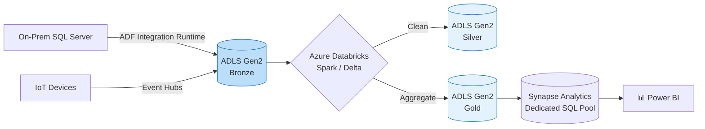

# 🟦 Azure Data Engineering

Microsoft Azure is highly popular in enterprise environments, especially for companies heavily invested in the Microsoft ecosystem (Active Directory, SQL Server, Power BI).

## 🛠️ Core Azure Data Services

### 1. 🪣 Storage
- **Azure Data Lake Storage (ADLS) Gen2**: The foundation of the Azure data platform. Unlike standard blob storage, ADLS Gen2 has a **hierarchical namespace**, meaning it organizes data into real folders and directories, making big data processing (like Spark) significantly faster.

### 2. 📥 Ingestion & Streaming
- **Azure Event Hubs**: Highly scalable data streaming platform and event ingestion service (Microsoft's alternative to Kafka).
- **Azure IoT Hub**: Specifically tailored for capturing telemetry data from IoT devices.

### 3. ⚙️ Processing & ETL
- **Azure Data Factory (ADF)**: The primary ETL and data integration service. Allows visual drag-and-drop pipeline creation, scheduling, and orchestration.
- **Azure Databricks**: A massively popular, highly optimized Apache Spark environment tailored specifically for Azure. Often used as the primary compute engine in the Medallion Architecture.

### 4. 🗄️ Warehousing & Analytics
- **Azure Synapse Analytics**: A limitless enterprise analytics service that brings together data integration, enterprise data warehousing (SQL Pools), and big data analytics (Spark Pools).

### 5. 📊 Consumption
- **Power BI**: Microsoft's industry-leading BI tool, deeply integrated with Synapse and ADLS.

## 🗺️ Standard Azure Pipeline Architecture

## 🗣️ Interview Talking Point
*"A typical architecture I build on Azure utilizes **Azure Data Factory** purely for orchestration and EL (Extract/Load) to bring raw data into **ADLS Gen2**. From there, I rely on the massive distributed compute power of **Azure Databricks** to perform complex transformations, utilizing the Medallion Architecture (Bronze/Silver/Gold) on top of **Delta Lake** before serving it to **Synapse** for Power BI consumption."*