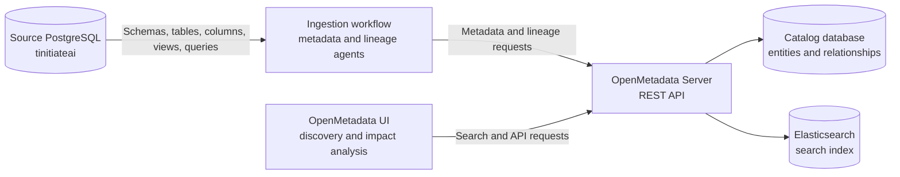
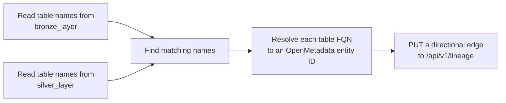

# OpenMetadata Data Lineage

[← Back to main README](../README.md) · [Data Lineage](../data-lineage.md) · [🏠 Tinitiate Home](https://tinitiate.com)

This folder is a local OpenMetadata lab for discovering PostgreSQL metadata and showing lineage between Bronze, Silver, and Gold data assets.

OpenMetadata is a metadata platform, not a data movement tool. It reads technical metadata from source systems, stores relationships in its catalog, indexes assets for search, and presents the results through its UI and APIs. The business data remains in the source database.

## What runs in this lab

| Component | Purpose | Local port |
|---|---|---:|
| OpenMetadata Server | REST API, catalog services, authentication, and web UI | `8585` |
| OpenMetadata Admin | Health and administration endpoint | `8586` |
| Ingestion / Airflow | Schedules and runs metadata ingestion workflows | `8080` |
| Elasticsearch | Search index used for fast asset discovery | `9200` |
| Internal PostgreSQL | Stores OpenMetadata and Airflow application state | `5440` |
| Source PostgreSQL | Holds the `tinitiateai` Bronze, Silver, and Gold tables | `5432` |

`docker-compose-postgres.yml` uses PostgreSQL for OpenMetadata's internal state. `docker-compose.yml` provides the equivalent stack with MySQL. Run only one stack at a time.

The internal catalog database is not the database being scanned. Your source connection must point to the PostgreSQL instance that contains `tinitiateai`, currently expected at `localhost:5432` by the Python examples.

## Architecture



## End-to-end process

### 1. Start the platform

From this folder, start the PostgreSQL-backed stack:

```powershell
docker compose -f docker-compose-postgres.yml up -d
docker compose -f docker-compose-postgres.yml ps
```

The migration container prepares the internal database, the server starts on `http://localhost:8585`, Elasticsearch builds the search indexes, and the ingestion container exposes Airflow on `http://localhost:8080`.

### 2. Register the source service

In OpenMetadata:

1. Open **Settings → Services → Databases**.
2. Add a PostgreSQL service.
3. Use the service name `Postgres DB` if you want to run `openmetadata.py` without changing `SERVICE_NAME`.
4. Configure the host so it is reachable from the ingestion container. Inside Docker, `localhost` means the ingestion container itself. On Docker Desktop, use `host.docker.internal` when the source PostgreSQL server runs on the host.
5. Test and save the connection.

The service name becomes part of each asset's fully qualified name. For this lab, a table FQN has this shape:

```text
Postgres DB.tinitiateai.bronze_layer.customers
```

### 3. Run metadata ingestion first

Create a metadata ingestion workflow for the PostgreSQL service and include these schemas:

```text
bronze_layer
silver_layer
gold_layer
```

The metadata workflow discovers databases, schemas, tables, views, columns, data types, constraints, and other supported properties. It creates catalog entities before lineage edges are resolved. View definitions can also produce view lineage during metadata ingestion.

This ordering matters: lineage references existing entities by ID or FQN. If a table has not been ingested, the custom script reports `Not found in OpenMetadata` and skips that edge.

### 4. Create lineage

OpenMetadata supports several complementary lineage methods:

- **Automatic lineage agent:** Reads supported database query history, parses data-moving SQL, and publishes source-to-target relationships. Statements such as `INSERT ... SELECT`, `CREATE VIEW AS`, `UPDATE ... FROM`, and `MERGE` can produce lineage.
- **View lineage:** Extracted from view SQL as part of metadata ingestion when the connector can retrieve the definition.
- **Pipeline and dashboard ingestion:** Connects cataloged database assets to orchestration pipelines, charts, and dashboards when the corresponding services are ingested and mapped.
- **Manual lineage:** Users can connect tables and columns in the OpenMetadata lineage editor.
- **API or SDK lineage:** Applications can explicitly publish edges when runtime query history is unavailable or business logic cannot be inferred reliably.

Your `openmetadata.py` example uses the API approach.

## How `openmetadata.py` works

The script builds table-level Bronze-to-Silver lineage in five steps:



For a table named `customers`, the script constructs:

```text
Postgres DB.tinitiateai.bronze_layer.customers
    → Postgres DB.tinitiateai.silver_layer.customers
```

It then:

1. Queries `information_schema.tables` in both schemas.
2. Intersects the table-name sets, so only identically named tables are connected.
3. Calls `GET /api/v1/tables/name/{fqn}` for the source and target.
4. Reads the returned entity IDs.
5. Calls `PUT /api/v1/lineage` with a `table → table` edge.

The edge direction is important: `fromEntity` is upstream and `toEntity` is downstream. Re-running the script is intended to upsert the relationship rather than create a separate visual edge.

Run it after source metadata has been ingested:

```powershell
python openmetadata.py
```

### Current script limitations

- It creates table-level lineage only; it does not describe column mappings or transformation SQL.
- It assumes Bronze and Silver tables use identical names.
- It does not create Silver-to-Gold lineage.
- It uses fixed service, database, schema, and connection values.
- It contains a hard-coded access token and database password. Treat the token as compromised if this repository is shared, revoke it, and load credentials from environment variables or a secret manager before using the script outside a local lab.

## Table lineage versus column lineage

Table lineage answers:

```text
Which upstream tables feed this table?
```

Column lineage answers:

```text
Which source columns and expressions produced this target column?
```

For example:

```text
bronze_layer.customers.customer_id
    → silver_layer.customers.customer_id

bronze_layer.customers.first_name + bronze_layer.customers.last_name
    → silver_layer.customers.full_name
```

Automatic column lineage depends on parseable SQL and resolvable source and target entities. Complex dynamic SQL, stored procedures, temporary objects, or unsupported dialect features may require explicit API/SDK mappings or manual edits.

## Query-log lineage process

For supported connectors, the lineage workflow generally follows this sequence:

1. Read recent query history using the source connection.
2. Filter for statements that move or transform data.
3. Parse SQL using the appropriate database dialect.
4. Identify source tables, target tables, and column expressions.
5. Resolve names against assets already present in the catalog.
6. Build directional table and, where possible, column edges.
7. Publish lineage requests to the OpenMetadata server.
8. Display the graph in each asset's **Lineage** tab.

If direct query-history extraction is unavailable, OpenMetadata can process a query-log CSV containing `query_text` and optional database and schema context.

## Data dictionary generator

`generate_data_dictionary.py` reads `information_schema.columns` and produces CSV and Markdown inventories for the three layers. It is separate from OpenMetadata ingestion and does not publish descriptions or lineage to the catalog.

Before running it, change `OUTPUT_DIR`; the current value points to `C:/Projects/openmetadata-demo/output` rather than this repository's `output` folder.

```powershell
python generate_data_dictionary.py
```

## Validation checklist

After running ingestion and the custom lineage script, verify:

- The PostgreSQL service appears under **Settings → Services → Databases**.
- Bronze, Silver, and Gold schemas are searchable.
- Expected tables have the correct columns and fully qualified names.
- A Silver table's **Lineage** tab shows its Bronze upstream.
- Expanding upstream and downstream nodes produces the expected impact path.
- Ingestion workflow logs contain no connection, permission, parsing, or entity-resolution errors.

## Troubleshooting

### Source connection fails

Do not use `localhost:5432` from the ingestion container for a database running on the Windows host. Use `host.docker.internal:5432`, confirm PostgreSQL accepts non-loopback connections, and allow the connection in `pg_hba.conf` and the host firewall.

### The script says a table was not found

Run metadata ingestion first, then check that `SERVICE_NAME`, `DATABASE_NAME`, schema, table name, and capitalization exactly match the FQN shown in OpenMetadata.

### Assets appear but lineage is empty

Metadata ingestion and lineage ingestion are distinct workflows. Enable and run the lineage agent, or publish the relationships with `openmetadata.py`. Also confirm the source retains enough query history and that the ingestion user can read it.

### Search results are missing or stale

Check the OpenMetadata server and Elasticsearch health, then inspect the container logs:

```powershell
docker compose -f docker-compose-postgres.yml ps
docker compose -f docker-compose-postgres.yml logs openmetadata-server
docker compose -f docker-compose-postgres.yml logs elasticsearch
docker compose -f docker-compose-postgres.yml logs ingestion
```

## Official references

- [OpenMetadata data lineage guide](https://docs.open-metadata.org/v1.12.x/how-to-guides/data-lineage)
- [Deploy a lineage workflow](https://docs.open-metadata.org/v1.12.x/how-to-guides/data-lineage/workflow)
- [Explore the lineage view](https://docs.open-metadata.org/v1.12.x/how-to-guides/data-lineage/explore)
- [Column-level lineage](https://docs.open-metadata.org/v1.12.x/how-to-guides/data-lineage/column)
- [Lineage REST API](https://docs.open-metadata.org/v1.12.x/api-reference/lineage)
- [Docker deployment](https://docs.open-metadata.org/v1.12.x/deployment/docker)

---

[← Back to main README](../README.md) · [Data Lineage](../data-lineage.md) · [🏠 Tinitiate Home](https://tinitiate.com)
