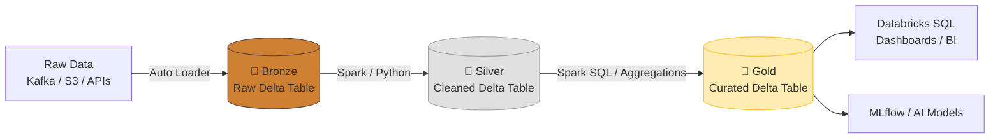

# 🧱 Databricks

**Databricks** is a unified data analytics platform built by the original creators of Apache Spark. It provides a collaborative workspace for Data Engineers, Data Scientists, and Data Analysts to work together using the **Data Lakehouse** architecture.

## 🌟 Why Databricks?

Historically, Data Lakes (cheap storage, raw files) and Data Warehouses (expensive, structured SQL) were separate systems. Databricks pioneered the **Lakehouse**, which brings the reliability and performance of a data warehouse directly to the data lake using **Delta Lake**.

## 🛠️ Core Concepts

1. **✨ Managed Apache Spark**: Databricks abstracts away the extreme complexity of configuring and managing Spark clusters. You simply select your cluster size, and Databricks provisions it on AWS/Azure/GCP.
2. **🌊 Delta Lake**: An open-source storage layer that brings **ACID transactions** (reliability, rollbacks, concurrent reads/writes) to Apache Spark and big data workloads.
3. **📓 Collaborative Notebooks**: An IDE in the browser where users can write Python, SQL, Scala, and R in the same exact file.
4. **🚀 Photon Engine**: A vectorized query engine written in C++ that executes queries dramatically faster than standard Apache Spark.
5. **🛡️ Unity Catalog**: The unified governance solution. It provides centralized access control, auditing, data lineage, and data discovery across all Databricks workspaces.

## 🗺️ Databricks & The Medallion Architecture

Databricks is famous for popularizing the Medallion Architecture.

## 🗣️ Interview Talking Point
*"If asked to build a pipeline on Databricks, I emphasize using **Auto Loader** for scalable, incremental ingestion into the Bronze layer. From there, I use **Delta Live Tables (DLT)** to declare data pipelines in SQL or Python, allowing Databricks to automatically handle dependency graphs, data quality checks, and infrastructure scaling as data moves from Silver to Gold."*