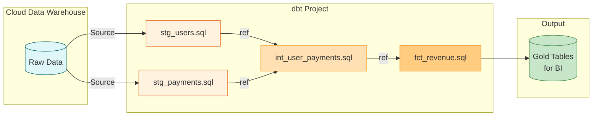

# 🛠️ dbt (Data Build Tool)

**dbt** is a transformation workflow framework that allows anyone who knows SQL to deploy analytics code following software engineering best practices (like modularity, portability, CI/CD, and documentation).

dbt is the **"T" (Transform)** in the modern **ELT** (Extract, Load, Transform) stack. It assumes your raw data has already been loaded into a Data Warehouse (like Snowflake or BigQuery), and it executes transformations purely by running SQL against that warehouse.

## 🌟 Why is dbt so popular?

Before dbt, data analysts wrote massive, 1,000-line "spaghetti SQL" scripts that were impossible to debug, test, or version control. dbt allows you to build data pipelines like a software engineer builds an application.

## 🧩 Core Concepts

1. **🏗️ Modularity (Models)**: Instead of one massive script, you write small, reusable `SELECT` statements called *Models*. dbt links them together automatically.
2. **🔗 The `{{ ref() }}` function**: You never hardcode table names. You reference other models using Jinja templating (e.g., `SELECT * FROM {{ ref('stg_customers') }}`). dbt uses this to automatically build a DAG (Directed Acyclic Graph) to figure out what order to run the SQL in.
3. **✅ Automated Testing**: You can add YAML configurations to test if a column `is_unique`, `not_null`, or contains specific `accepted_values`. If the test fails, dbt alerts you.
4. **📚 Documentation**: dbt automatically generates a beautiful, searchable web-based data dictionary showing your tables, column definitions, and the pipeline DAG.
5. **💾 Materializations**: By changing one word in a config file, you can tell dbt to deploy your SQL code as a `view`, a `table`, or an `incremental` load. You don't have to write the DDL (`CREATE TABLE AS...`).

## 🗺️ dbt Flow & Architecture

## 🗣️ Interview Talking Point
*"dbt bridges the gap between Data Engineering and Analytics. By using dbt, I empower Analytics Engineers to own the transformation layer. I set up the CI/CD pipelines via GitHub Actions so that whenever a change to a dbt model is submitted via Pull Request, it runs data quality tests in a dev schema before ever deploying to production."*