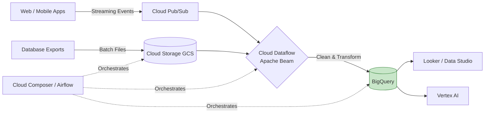

# 🟩 GCP Data Engineering

Google Cloud Platform (GCP) is renowned for its data analytics and machine learning capabilities. It relies heavily on open-source frameworks (often created by Google, like Kubernetes and Apache Beam) and serverless architectures.

## 🛠️ Core GCP Data Services

### 1. 🪣 Storage
- **Google Cloud Storage (GCS)**: The unified object storage solution for data lakes on GCP.

### 2. 📥 Ingestion & Streaming
- **Cloud Pub/Sub**: Serverless, globally distributed message bus. Used for streaming analytics and real-time event delivery (similar to Kafka/Kinesis).

### 3. ⚙️ Processing & ETL
- **Cloud Dataflow**: A fully managed streaming and batch data processing service based on **Apache Beam**. Write code once, and use it for both batch and streaming pipelines.
- **Cloud Dataproc**: A managed Hadoop and Spark service. Used to easily lift-and-shift existing on-prem Spark/Hadoop workloads to the cloud.

### 4. 🗄️ Warehousing & Analytics
- **BigQuery**: Google's crown jewel. A fully managed, serverless Data Warehouse with built-in ML capabilities. You don't manage infrastructure, nodes, or clusters; you just write SQL and Google handles the compute under the hood.

### 5. 🕒 Orchestration
- **Cloud Composer**: A fully managed Apache Airflow service used to author, schedule, and monitor pipelines.

## 🗺️ Standard GCP Pipeline Architecture

## 🗣️ Interview Talking Point
*"BigQuery is a game-changer because of its absolute separation of compute and storage. During an interview, I highlight that with BigQuery, I don't have to worry about provisioning 'Warehouse Sizes' or managing clusters. I focus on optimizing my queries and partitioning/clustering my tables, while Google's Dremel engine scales to thousands of CPUs instantly to return terabytes of queried data in seconds."*