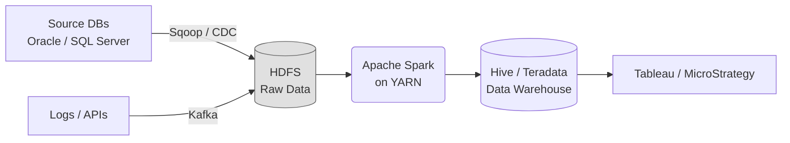

# 🏢 On-Premises Data Engineering

While the cloud is the modern standard, many enterprise organizations (especially in Finance, Healthcare, and Government) still run **On-Premises** (On-Prem) data centers due to strict regulatory compliance, data sovereignty laws, or massive sunk-cost investments in physical hardware.

## ⚙️ The On-Premises Hadoop Ecosystem

The foundation of big data engineering on-prem is typically the **Hadoop Ecosystem**.

- 🐘 **HDFS (Hadoop Distributed File System)**: The foundational storage layer. It splits massive files into blocks (e.g., 128MB) and distributes them across a cluster of physical servers.
- 🗺️ **MapReduce & YARN**: The original processing framework (MapReduce) and the resource manager (YARN) that decides which servers compute which tasks.
- 🐝 **Apache Hive**: Provides a SQL-like interface to query data stored in HDFS. It translates SQL queries into MapReduce or Tez jobs.
- ✨ **Apache Spark**: The modern standard for in-memory processing. In an on-prem environment, it runs on top of YARN to process data much faster than MapReduce.
- 📬 **Apache Kafka**: Used for high-throughput, fault-tolerant real-time data streaming between applications and the data lake.

## 🗄️ Traditional Enterprise Data Warehouses (EDW)

Before Cloud Data Warehouses, companies relied on massive, expensive, specialized hardware appliances:
- **Teradata**
- **Oracle Exadata**
- **IBM Netezza**
- **Microsoft SQL Server (SSAS/SSIS)**

## 🗣️ Interview Focus: Cloud vs. On-Prem

If asked to compare Cloud vs On-Prem, focus on **Scalability and Cost**:

| Feature | On-Premises | Cloud |
| :--- | :--- | :--- |
| **Compute & Storage** | Tightly coupled (To add storage, you must buy a server that also adds compute). | **Decoupled** (You can scale storage infinitely without paying for compute). |
| **Scalability** | **Vertical / Fixed**: Takes months to order and rack new physical servers. | **Elastic**: Spin up 1,000 nodes in seconds; shut them down when done. |
| **Cost Model** | **CapEx** (Capital Expenditure) - Huge upfront costs. | **OpEx** (Operational Expenditure) - Pay for what you use. |
| **Maintenance** | High. Requires dedicated IT staff to replace hard drives, patch OS, upgrade networks. | Managed by AWS/Azure/GCP. |

## 🗺️ Typical On-Premises Flow

