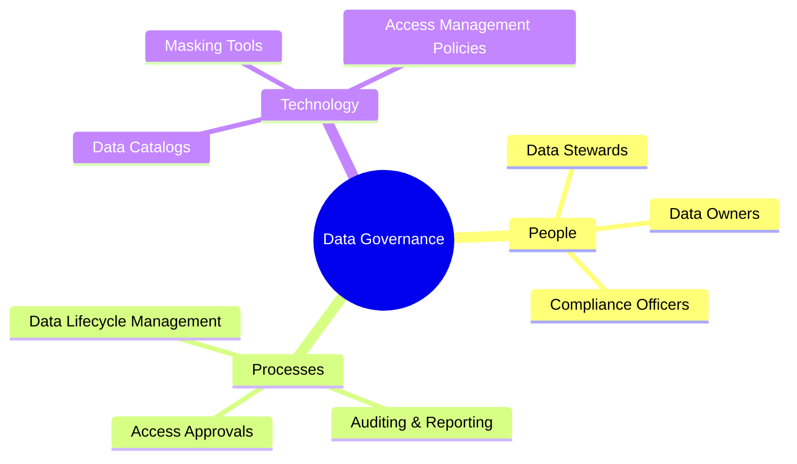

# 🛡️ Data Governance

**Data Governance** is the overarching framework of people, processes, and technologies that ensures the availability, usability, integrity, and security of data used within an enterprise. 

In an interview, if you are asked about Data Governance, emphasize that it is **not just an IT problem—it's a business discipline.**

## 🏛️ Core Pillars of Data Governance

1. 🔒 **Security & Privacy**: Enforcing Role-Based Access Control (RBAC), masking Personally Identifiable Information (PII/PHI), and ensuring compliance with laws like GDPR, CCPA, and HIPAA.
2. 📚 **Data Cataloging & Metadata**: Making data discoverable. It answers: *What data do we have? Who owns it? What does it mean?*
3. 🧭 **Data Lineage**: Tracking where data comes from and how it transforms across the pipeline.
4. ✅ **Data Quality**: Ensuring data is accurate, complete, and reliable for decision-making.

## 🗺️ The Governance Framework

## 🏢 Why it matters for interviews
- **Prevents the Data Swamp**: Without governance, a Data Lake quickly becomes an unusable, untrusted "Data Swamp."
- **Compliance Audits**: Companies face massive fines if they cannot prove who accessed sensitive customer data and why.
- **Single Source of Truth**: Resolves business conflicts where the Sales department reports $10M in revenue, but the Finance department reports $8M.

## 🛠️ Popular Tools
- **Enterprise Catalogs**: Collibra, Alation, Informatica.
- **Cloud Native Governance**: AWS Lake Formation, Azure Purview, Google Cloud Dataplex.
- **Open Source / Modern**: DataHub, Amundsen, Apache Atlas.

## 🗣️ Interview Talking Point
*"To build a highly governed data platform, I ensure that PII is masked at the point of ingestion (Bronze layer), tag datasets with metadata in our catalog, and strictly enforce RBAC at the consumption (Gold) layer so only authorized BI tools and users can view sensitive metrics."*