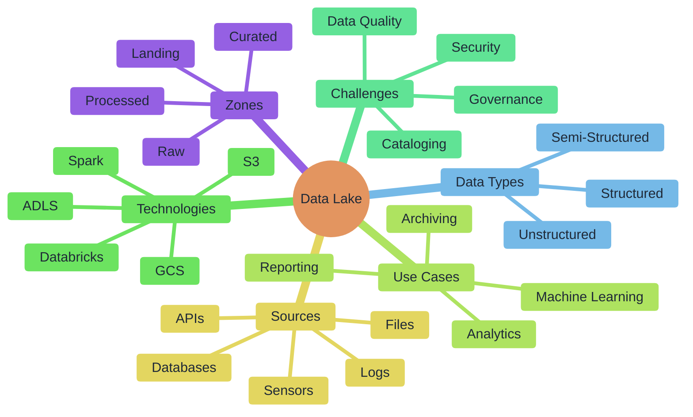

# Data Lake

A Data Lake is a centralized storage system that keeps raw, semi-processed, and processed data in its original or near-original format. It is designed to store structured, semi-structured, and unstructured data at large scale.

## Key Features

**What a Data Lake does**

* Stores data from many different sources in one place

* Accepts data in its native format

* Supports future analytics, reporting, and machine learning

* Useful when businesses want flexibility before deciding final structure

**Why it is called schema-on-read**

* In traditional databases, structure is defined before loading data

* In a data lake, data is stored first

* Structure is applied later when users read or process the data

**Types of data stored**

* Structured data: tables, CSV, relational exports

* Semi-structured data: JSON, XML, logs

* Unstructured data: images, video, audio, PDFs, emails

**Common zones in a Data Lake**

* Landing Zone: initial arrival area

* Raw Zone: original source data stored as-is

* Transformed Zone: cleaned and processed data

* Curated Zone: trusted datasets for analytics and business use

**Why organizations use it**

* Very scalable

* Lower storage cost

* Good for data science and machine learning

* Can store all enterprise data together

* Useful for future reuse of raw historical data

## Flow Diagram

```mermaid
flowchart LR
    S[Sources<br/>DB / Files / APIs / Logs / Sensors] --> I[Ingestion<br/>ADF / Glue / Kafka]
    I --> L[Landing<br/>Initial Intake]
    L --> R[Raw Lake<br/>Source Data]
    R --> P[Processing<br/>Spark / ETL]
    P --> T[Transformed<br/>Validated Data]
    T --> C[Curated<br/>Data Products]
    C --> U[Consumption<br/>BI / SQL / ML]

    style S fill:#F6D8C9,stroke:#E5E7EB,stroke-width:1.5px,color:#111827
    style I fill:#F8C9A0,stroke:#E5E7EB,stroke-width:1.5px,color:#111827
    style L fill:#DDE5E3,stroke:#E5E7EB,stroke-width:1.5px,color:#111827
    style R fill:#BFE7D0,stroke:#E5E7EB,stroke-width:1.5px,color:#111827
    style P fill:#98D9BE,stroke:#E5E7EB,stroke-width:1.5px,color:#111827
    style T fill:#FBE7A1,stroke:#E5E7EB,stroke-width:1.5px,color:#111827
    style C fill:#FFD36E,stroke:#E5E7EB,stroke-width:1.5px,color:#111827
    style U fill:#D9C2F0,stroke:#E5E7EB,stroke-width:1.5px,color:#111827

    linkStyle default stroke:#E5E7EB,stroke-width:2px
``` 

## Mind Map

## Business Examples

### Finance

* **Scenario:** Enterprise financial data lake for fraud, risk, and compliance

**Data stored**

* ATM transactions
* POS card swipes
* Mobile banking events
* Trading feeds
* Customer service chat/email records
* Audit logs

**How the lake is used**

* Fraud detection model training
* Risk analytics
* Customer behavior analysis
* Regulatory retention and investigation

**Talking Point**
* Finance needs to store both raw transaction history and processed analytical data for compliance and advanced analytics.

### Healthcare

* **Scenario:** Unified healthcare data lake for patient and clinical analytics

**Data stored**

* EHR exports
* Lab reports
* Medical imaging metadata
* Doctor notes
* Insurance claims
* Wearable or device data

**How the lake is used**

* Patient journey analysis
* Clinical research
* Readmission prediction
* Population health reporting
* AI-assisted diagnostics

**Talking Point**
* Healthcare data comes from many disconnected systems and in many formats, so a data lake helps centralize everything.

### Retail

* **Scenario:**  Retail customer and sales analytics data lake

* **Data stored**
* POS sales transactions
* Web clickstream events
* Product catalog files
* Inventory snapshots
* Loyalty program activity
* Promotion campaign data

**How the lake is used**

* Demand forecasting
* Recommendation systems
* Basket analysis
* Sales trend reporting
* Customer segmentation

**Talking Point**
* Retail uses the lake to combine online and offline business data in one place for analytics and ML.

### Oil & Gas

* **Scenario:** Operational and production data lake

* **Data stored**

* Well sensor data
* Drilling logs
* Equipment maintenance history
* Production reports
* Pipeline flow readings
* Geospatial and seismic files

**How the lake is used**

* Predictive maintenance
* Production optimization
* Asset performance monitoring
* Engineering analysis
* Safety and incident investigation

**Talking Point**
* Oil & Gas generates huge volumes of machine and sensor data that fit naturally into a data lake.

### Power / Energy

* **Scenario:**  Smart grid and energy analytics data lake

* **Data stored**

* Smart meter readings
* Grid event logs
* Outage records
* Plant generation data
* Billing records
* IoT sensor streams

**How the lake is used**

* Load forecasting
* Consumption pattern analysis
* Outage prediction
* Grid reliability monitoring
* Customer billing analytics

**Talking Point**
* Power companies use data lakes because they must manage high-volume time-series data from meters and infrastructure.

**Pharmaceuticals**

* **Scenario:** Pharma research, manufacturing, and compliance data lake

* **Data stored**

* Clinical trial records
* Lab experiment results
* Batch manufacturing logs
* Quality control reports
* Shipment and supply chain data
* Regulatory submission documents

**How the lake is used**

* Clinical analytics
* Drug development research
* Batch quality monitoring
* Compliance reporting
* Supply chain visibility

**Talking Point**
* Pharmaceutical companies need both scientific data and manufacturing data in one platform for traceability and analytics.

**Implementation Notes**

   **Storage platforms**
* Common choices:
  * AWS S3
  * Azure Data Lake Storage
  * Google Cloud Storage

* These are used because they are scalable, durable, and cost-effective.

**Data types supported**

* A Data Lake can store:

  * Structured data
  * Semi-structured data
  * Unstructured data

**Examples:**

* CSV tables
* JSON logs
* XML files
* PDFs
* Images
* Audio
* Video
* Sensor streams

**Typical zone design**

* A practical Data Lake is often divided into zones:

**Landing Zone**
* Temporary arrival area for incoming data

**Raw Zone**
* Original source data stored as-is

**Processed / Transformed Zone**
* Cleaned and standardized data

**Curated Zone**
* Trusted data for analytics, ML, and reporting

**Common ingestion methods**

Data can enter the lake through:

* Batch file loads
* APIs
* Database extracts
* Streaming ingestion
* IoT event capture

**Common tools:**

* Kafka
* AWS Kinesis
* Azure Event Hubs
* Data Factory
* Glue
* NiFi

**Processing engines**

**To transform and analyze lake data, organizations often use:**

* Apache Spark
* Databricks
* AWS Glue
* Azure Synapse
* Flink for streaming
* SQL engines on top of lake storage

**Governance requirements**

* **A Data Lake should not be unmanaged.**

   **Important controls:**

     * Metadata management
     * Data cataloging
     * Access control
     * Lineage tracking
     * Audit logging
     * Data classification

Without governance, the lake can become a **data swamp.**

**Security controls**

* **Implementation should include:**

   * IAM-based access control
   * Encryption at rest
   * Encryption in transit
   * Role-based permissions
   * Audit monitoring
   * Masking of sensitive data where required

This is especially important in finance, healthcare, and pharma.

**Processing style**

*  **A Data Lake can support:**
    * Batch processing
    * Near real-time processing
    * Streaming analytics
    * Machine learning workloads
    * Historical archival analysis

**Integration with analytics systems**

  * **A Data Lake usually connects to:**

    * BI tools
    * Data science notebooks
    * Machine learning pipelines
    * SQL query engines
    * Data warehouse or lakehouse layers

**Best practice points for students**

* Keep raw data unchanged
* Separate zones clearly
* Add metadata from the beginning
* Apply security early
* Track lineage and ownership
* Use curated datasets for reporting, not raw files directly