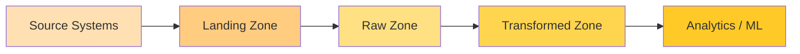
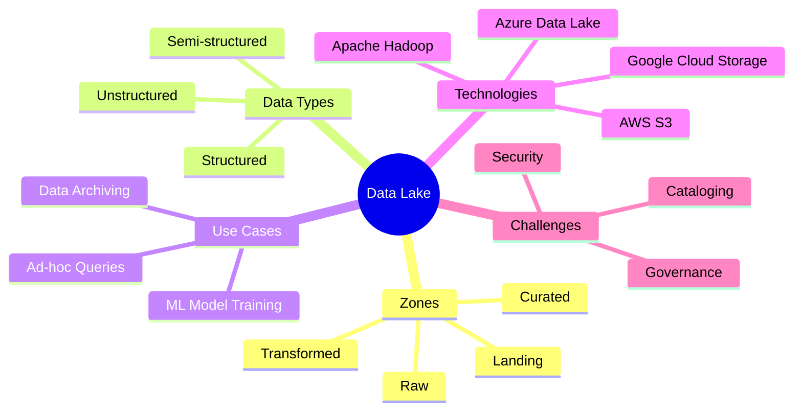

# Data Lake

A Data Lake is a centralized repository that stores raw and processed data in its native format. It supports structured, semi-structured, and unstructured data, enabling flexible analytics and machine learning.

## Key Features
- 🌊 **Schema-on-read**: Structure is applied when data is accessed, not when ingested
- ⚖️ **High variety**: Handles files, logs, images, audio, and more
- 💾 **Economical storage**: Often built on low-cost object stores (S3, ADLS)
- 🔁 **Scalable processing**: Works with batch or streaming engines

## Flow Diagram

## Mind Map

## Business Examples

### Media & Entertainment
- **Scenario**: Store video streams, user behavior logs, and social media feeds
- **Use**: Train recommendation algorithms and perform sentiment analysis

### Healthcare
- **Scenario**: Keep genomic sequences, imaging data, and EHR text notes
- **Use**: Support research, clinical decision support, and AI diagnostics

### Finance
- **Scenario**: Retain tick data, transaction logs, and customer correspondence
- **Use**: Conduct risk analytics, fraud detection, and regulatory retention

## Implementation Notes
- Data lakes often precede or complement warehouses in a lakehouse architecture
- Cataloging tools (Glue, Data Catalog, Apache Atlas) are critical for discoverability
- Enforce governance using IAM policies, encryption, and audit logging

> Data lakes provide flexibility for innovators but require discipline around metadata and security to avoid becoming data swamps.