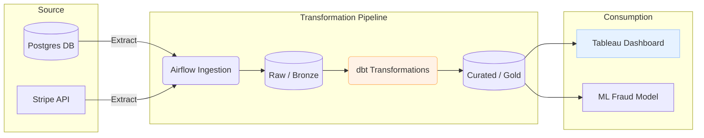

# 🧭 Data Lineage

**Data Lineage** is the lifecycle map of data. It tracks data's origin, what happens to it, and where it moves over time. It provides visibility into the "Who, What, When, Where, and Why" of your data pipelines.

## 🎯 Key Use Cases

1. **💥 Impact Analysis (Proactive)**
   - *Scenario*: A software engineer wants to change the name of the column `cust_id` to `customer_identifier` in the main application database.
   - *Lineage Benefit*: The Data Engineer can check lineage to see exactly which downstream ETL jobs, Data Warehouse tables, and Tableau dashboards will break if this change occurs.

2. **🔍 Root Cause Analysis (Reactive)**
   - *Scenario*: The CEO notices the "Total Revenue" on a dashboard dropped to zero unexpectedly.
   - *Lineage Benefit*: Engineers can trace the dashboard metric backward through the Gold and Silver tables, all the way to the source API, to pinpoint exactly which pipeline job failed or which source system sent bad data.

3. **📜 Compliance & Auditing**
   - *Scenario*: Regulators require proof of how a customer's credit score was calculated.
   - *Lineage Benefit*: Proves exactly which datasets and transformations fed into the ML model that generated the score.

## 🗺️ Visualizing Lineage

