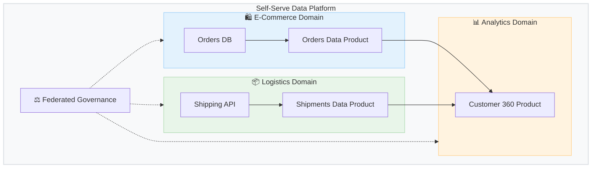

# 🕸️ Data Mesh

**Data Mesh** is a decentralized sociotechnical approach to managing data at scale. Instead of centralizing data into a single monolithic Data Lake or Data Warehouse managed by an isolated data engineering team, Data Mesh treats data as a **product** managed by the specific business domains that generate or consume it.

## 🎯 Four Core Principles

1. 🏢 **Domain-Oriented Decentralized Ownership**
   - Data is owned by the teams that understand it best (e.g., the Sales team owns sales data, HR owns employee data).
2. 📦 **Data as a Product**
   - Domains treat their data as a product provided to the rest of the organization, ensuring high quality, discoverability, documentation, and SLA adherence.
3. 🛠️ **Self-Serve Data Infrastructure as a Platform**
   - A centralized platform team provides the tools and infrastructure so domains can easily build, deploy, and manage their data products without reinventing the wheel.
4. ⚖️ **Federated Computational Governance**
   - Global standards (security, privacy, interoperability) are enforced automatically across all domains, while domains retain autonomy over their specific business logic.

## 🗺️ Visualizing the Mesh

