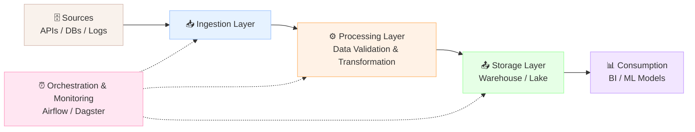

# 🚀 Data Pipelines

A **Data Pipeline** is a set of automated processes that extract data from various sources, transform it into a usable format, and load it into a destination (like a data warehouse or data lake) for analysis, reporting, or machine learning.

## 🌟 Key Concepts

- 📥 **Extraction**: Pulling data from source systems (APIs, databases, flat files, streams).
- ⚙️ **Transformation**: Cleaning, enriching, filtering, and aggregating data.
- 📤 **Loading**: Writing the processed data into the target system.
- 🕒 **Orchestration**: Scheduling and managing the execution of pipeline tasks (e.g., Apache Airflow, Prefect).
- 🚨 **Monitoring & Alerting**: Tracking pipeline health, data quality, and handling failures gracefully.

## 🔄 Types of Data Pipelines

### 1. Batch Pipelines
- **Description**: Process data in large chunks at scheduled intervals (e.g., nightly, hourly).
- **Use Case**: Daily sales reporting, monthly financial aggregations.
- **Tools**: Apache Spark, AWS Glue, Traditional ETL tools.

### 2. Streaming (Real-Time) Pipelines
- **Description**: Process data continuously as it is generated.
- **Use Case**: Fraud detection, live dashboards, IoT monitoring.
- **Tools**: Apache Kafka, Apache Flink, Spark Streaming.

### 3. Micro-Batch Pipelines
- **Description**: A hybrid approach where data is processed in small batches very frequently (e.g., every minute) to simulate near-real-time ingestion.

## 🗺️ Flow Diagram

## 🏢 Business Use Cases
* **🛒 E-Commerce Personalization**: Clickstream data is ingested via Kafka, processed by Flink to update user profiles, and fed into a recommendation engine in real-time.
* **🏥 Healthcare Reporting**: Nightly batch jobs extract Electronic Health Records (EHR), transform them to mask PII (Personally Identifiable Information), and load them into a secure Data Warehouse for compliance reporting.