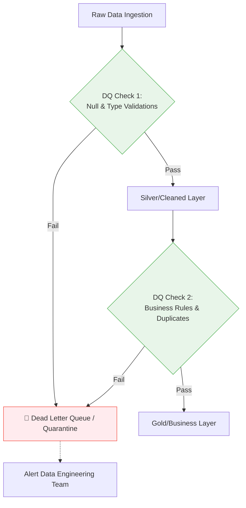

# ✅ Data Quality (DQ)

**Data Quality** refers to the measure of how well a dataset satisfies its intended business use case. High-quality data is the foundation of trustworthy analytics and machine learning. As the saying goes: *"Garbage in, garbage out."*

## 📏 The 6 Dimensions of Data Quality

1. **🎯 Accuracy**: Does the data accurately reflect the real-world event? *(e.g., A customer's age is 35, not 350).*
2. **🧩 Completeness**: Are there missing values? *(e.g., Are 10% of the `email_address` fields NULL?)*
3. **🔄 Consistency**: Does the data match across multiple systems? *(e.g., The CRM and the Billing system should show the same customer address).*
4. **⏰ Timeliness**: Is the data available when expected? *(e.g., Yesterday's sales data must be loaded by 8:00 AM today).*
5. **📋 Validity**: Does the data conform to a required format? *(e.g., A US zip code must be 5 or 9 digits).*
6. **💎 Uniqueness**: Are there duplicate records? *(e.g., A single transaction should only appear once in the fact table).*

## 🛡️ Data Quality Strategies in Pipelines

In modern pipelines, DQ checks are treated like **unit tests for data**.

### Key Implementation Concepts
- **Circuit Breakers**: If a DQ check fails drastically (e.g., total rows drop by 50%), stop the pipeline immediately to prevent bad data from overwriting good data in the warehouse.
- **Quarantine / Dead Letter Queues (DLQ)**: Instead of failing the whole job, write the bad records to a separate table for inspection, while allowing the good records to pass through.
- **Data Observability**: A modern trend that uses machine learning to automatically detect anomalies in data volume, freshness, and distribution without having to write manual rules.

## 🛠️ Popular Tools
- **Great Expectations**: Python-based framework for defining, testing, and generating DQ documentation.
- **dbt tests**: SQL-based assertions built directly into the transformation layer.
- **Monte Carlo / Datafold**: Enterprise Data Observability platforms.
- **Deequ**: Open-source DQ tool by Amazon built on Apache Spark.