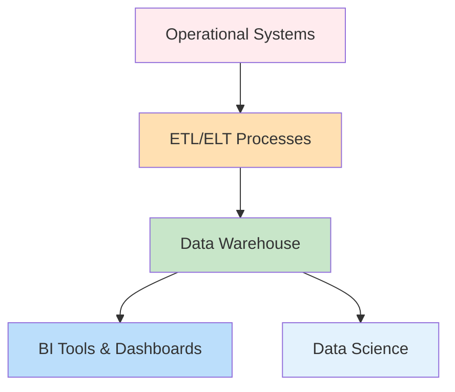
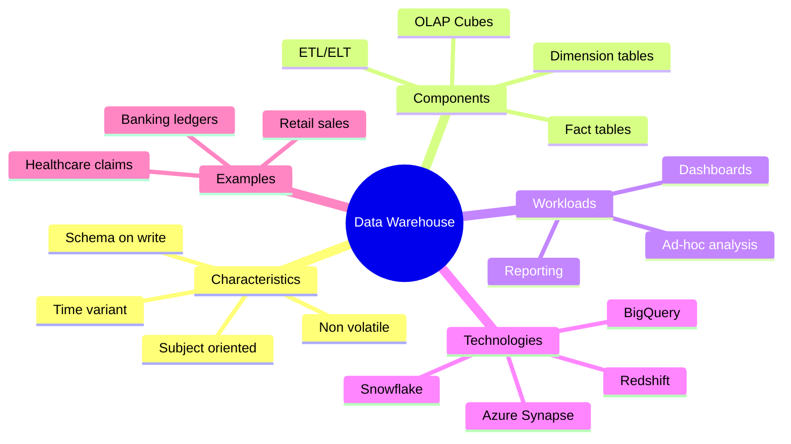

# Data Warehouse

A Data Warehouse (DW) is a centralized repository designed for analytics and reporting. It stores structured, cleaned, and integrated data from multiple sources, optimized for query performance.

## Core Characteristics
- 🧱 **Schema-on-write**: Data is structured when it enters the warehouse
- ⏱️ **Time-variant**: Historical data is preserved for trend analysis
- 📊 **Subject-oriented**: Organized around business domains (sales, finance, marketing)
- 🛡️ **Non-volatile**: Data is stable and not overwritten routinely

## Flow Diagram

## Mind Map

## Business Examples

### Retail
- **Scenario**: Consolidate POS, e-commerce, and inventory data
- **Outcome**: Daily and monthly sales dashboards for executives

### Healthcare
- **Scenario**: Combine claims, patient, and treatment data
- **Outcome**: Regulatory compliance reports and cost analysis

### Finance
- **Scenario**: Store trading, balances, and customer data
- **Outcome**: Risk analytics and quarterly financial reports

## Implementation Notes
- Modern warehouses are cloud-native (Snowflake, BigQuery) with elastic scaling
- Combine with a semantic layer (LookML, dbt) for business user accessibility
- Data marts or schema separation often used for multi-department access

> A warehouse provides a single source of truth for structured analytical needs and remains central to BI ecosystems.