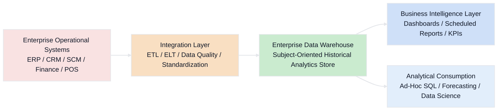
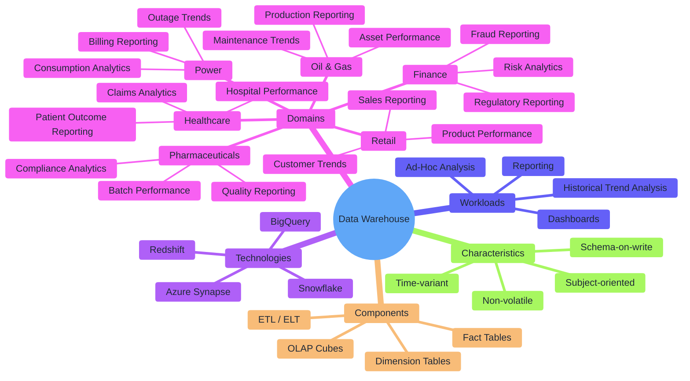

# Data Warehouse

A Data Warehouse (DW) is a centralized system designed to store structured, integrated, and historical data for reporting, analytics, and business intelligence.
It collects data from multiple source systems, cleans and organizes it, and makes it ready for fast querying.

## Key Points for Students
* **What a Data Warehouse does**
  * Collects data from many systems
  * Cleans and integrates that data
  * Stores it in a structured format
  * Supports dashboards, BI reports, and trend analysis

* **Schema-on-write**
  * Data structure is defined before or during loading
  * Data is transformed before it enters the warehouse
  * This makes reporting faster and more consistent

* **Time-variant**
  * Historical data is preserved
  * Helps analyze trends over days, months, quarters, and years
  * Useful for comparing past and present performance

* **Subject-oriented**
A warehouse is usually organized around business areas such as:

  * Sales
  * Finance
  * Marketing
  * Customers
  * Operations
  * Inventory

* **Non-volatile**

  * Data is stable after loading
  * It is usually inserted and updated through controlled ETL/ELT processes
  * Business users mainly read data rather than change it

* **Why companies use it**
  * Trusted reporting
  * Consistent KPIs
  * Faster analytical queries
  * Better decision-making
  * One version of business truth

## Flow Diagram

## Mind Map

## Business Examples

### **Finance** 
**Financial reporting, risk analytics, and compliance monitoring**

**Data loaded into the warehouse**

* Trading transactions
* Account balances
* Customer profiles
* Loan and credit records
* Payment histories
* Branch and regional performance data

**How it is used**

* Quarterly and annual financial reporting
* Risk exposure analysis
* Customer profitability analysis
* Regulatory reporting
* Executive dashboards for revenue, expenses, and margins

**Why Data Warehouse fits finance**

* Finance needs structured, accurate, and historical data
* Reports must be consistent across departments
* Query performance is important for large reporting workloads

**Talking point**
* A finance data warehouse gives decision-makers one trusted place for financial and regulatory reports.

### Healthcare
**Clinical, operational, and claims reporting**

**Data loaded into the warehouse**

* Patient visit summaries
* Claims data
* Billing data
* Treatment records
* Diagnosis summaries
* Department utilization metrics
* Provider performance data

**How it is used**

* Regulatory compliance reports
* Cost and claims analysis
* Patient outcome reporting
* Hospital utilization dashboards
* Readmission trend analysis

**Why Data Warehouse fits healthcare**

* Healthcare reporting depends on structured and integrated data
* Historical analysis is important for outcomes and operations
* Business and compliance teams need stable reporting data

**Talking point**
* A healthcare data warehouse helps hospitals and insurers turn patient and claims data into reliable reports.

### Retail

**Sales, inventory, and customer performance analytics**

**Data loaded into the warehouse**

* POS transactions
* E-commerce orders
* Product master data
* Store details
* Inventory snapshots
* Promotions and campaign data
* Customer purchase summaries

**How it is used**

* Daily and monthly sales dashboards
* Product performance analysis
* Region-wise revenue reporting
* Promotion effectiveness analysis
* Customer buying trend reports
* Inventory performance dashboards

**Why Data Warehouse fits retail**

* Retail leaders need fast, consistent reporting
* Data from stores, websites, and inventory systems must be combined
* Historical sales analysis supports forecasting and planning

**Talking point**
* A retail data warehouse creates one trusted reporting system for store, product, and customer analytics.

### Oil & Gas
**Production, operations, and maintenance reporting**

**Data loaded into the warehouse**
* Daily production summaries
* Drilling activity summaries
* Maintenance records
* Shipment data
* Facility and field master data
* Revenue and cost summaries
* Equipment utilization metrics

**How it is used**
* Production performance dashboards
* Field-level profitability reports
* Maintenance trend analysis
* Shipment and distribution reporting
* Asset utilization monitoring
* Executive operational reporting

**Why Data Warehouse fits oil & gas**
* Business users need summarized operational data, not raw engineering files
* Historical reporting is needed for planning and performance review
* Structured warehouse models support faster management reporting

**Talking point**
* Oil & Gas companies use warehouses for executive reporting on production, maintenance, and profitability.

### Power / Energy

**Consumption, billing, outage, and generation analytics**

**Data loaded into the warehouse**

* Smart meter summaries
* Billing records
* Plant generation data
* Outage summaries
* Customer usage history
* Rate plan information
* Grid performance metrics

**How it is used**

* Energy consumption dashboards
* Billing performance reporting
* Outage trend analysis
* Generation efficiency reports
* Customer usage analytics
* Planning and demand trend reports

**Why Data Warehouse fits power**

* Power companies need structured reporting across customers, infrastructure, and generation
* Historical usage and billing data is critical
* Fast reporting helps operations and business planning

**Talking point**
* A power data warehouse helps utilities analyze usage, outages, and billing in a structured way.

### Pharmaceuticals

**Quality, manufacturing, supply chain, and commercial reporting**

**Data loaded into the warehouse**

* Batch production summaries
* Quality control test results
* Supply chain and shipment records
* Product sales data
* Compliance reporting metrics
* Clinical trial summary data
* Inventory and distribution performance data

**How it is used**
* Quality compliance dashboards
* Batch performance reports
* Product distribution analytics
* Supply chain performance monitoring
* Sales and product performance reports
* Regulatory and audit support reporting

**Why Data Warehouse fits pharmaceuticals**
* Pharma requires highly structured, auditable reporting
* Quality and compliance depend on accurate historical records
* Multiple teams need consistent business metrics

**Talking point**
* A pharma data warehouse supports trusted reporting across manufacturing, compliance, and product performance.

## Implementation Notes
### Modern warehouses are cloud-native

 Today, most Data Warehouses are built on cloud platforms instead of traditional on-premise servers.

**Common platforms**
* Snowflake
* Google BigQuery
* Amazon Redshift
* Azure Synapse Analytics

**Why this matters**
* Easy to scale up or down
* No heavy hardware management
* Better support for large analytical workloads
* Faster setup and expansion

**Talking point**
* Modern warehouses are designed for the cloud, which makes them more flexible and scalable than older warehouse systems.

### Elastic scaling

Cloud Data Warehouses can increase or decrease compute resources based on workload.

**What this means**
* Small workloads use less compute
* Heavy reporting periods can use more compute
* Performance can improve without redesigning the full system

**Why this matters**

* Better cost control
* Faster dashboard and BI query performance
* Good for organizations with variable reporting demand

**Talking point**
* Elastic scaling helps warehouses handle both normal and peak reporting loads efficiently.

### Semantic layer improves business usability

A semantic layer gives business-friendly meaning to raw warehouse tables and columns.

**Examples**
* LookML in Looker
* dbt metrics and semantic models
* Business views in BI tools

**What it does**

* Converts technical column names into business terms
* Standardizes KPI definitions
* Helps non-technical users understand and use data correctly

**Example**
* Instead of showing a field like net_sales_amt, the semantic layer may present it as Net Sales.

**Talking point**
* A semantic layer makes warehouse data easier for business users to access and trust.

### Data marts support department-level analytics

Organizations often create smaller reporting areas from the central warehouse for specific departments.

**Examples of data marts**

* Sales mart
* Finance mart
* Marketing mart
* Operations mart
* HR mart

**Why this matters**
* Different teams need different reporting views
* Improves access control
* Makes analysis easier by focusing only on relevant subject areas

**Talking point**
* Data marts are like specialized sections of the warehouse built for specific business teams.

### Schema separation is used for better organization

Warehouses often separate data into schemas or layers.

**Example structure**
* raw_reporting
* staging
* core
* finance_mart
* sales_mart

**Why this matters**
* Keeps data organized
* Separates staging and final reporting layers
* Helps manage permissions and ownership
* Supports cleaner development and deployment practices

**Talking point**
* Schema separation keeps the warehouse clean, structured, and easier to manage.

### Warehouse supports a single source of truth

One of the biggest goals of a Data Warehouse is to provide one trusted version of business data.

**Why this matters**

* All departments use the same KPI definitions
* Reduces reporting conflicts
* Improves consistency in decision-making
* Helps executives trust dashboards and reports

** Talking point**
* A Data Warehouse becomes the central place for official business reporting.

### Integration with BI ecosystem

A warehouse is usually connected directly to reporting and analytics tools.

**Common BI tools**
* Power BI
* Tableau
* Looker
* QuickSight
* Excel reporting models

**Why this matters**

* Users can create dashboards directly from trusted warehouse data
* Reporting becomes faster and more standardized
* Business teams do not need to query raw source systems

**Talking point**
* The warehouse sits at the center of the BI ecosystem and powers dashboards and reports.

### Historical data is a major strength

Warehouses preserve business history for trend analysis.

**Examples**

* Monthly sales comparison
* Quarterly finance reporting
* Year-over-year growth
* Claim and treatment trends
* Long-term production analysis

**Why this matters**
* Businesses need historical context, not just current values
* Supports forecasting and strategic planning

** Talking point**
* A warehouse is not only for today’s data; it is also for understanding business performance over time.

### Structured modeling is important

Warehouses are typically designed using structured models.

**Common approaches**

* Star schema
* Snowflake schema
* Fact tables
* Dimension tables

**Why this matters**
* Improves reporting performance
* Makes analysis easier
* Helps business users understand data relationships

**Talking point**
* Warehouse design is intentional and business-focused, not just raw storage.

### Governance and quality controls are essential

Before data reaches the warehouse, it should be validated and standardized.

**Important controls**

* Data quality checks
* Standard business definitions
* Access control
* Audit logging
* Lineage tracking

**Why this matters**

* Reports must be accurate and trusted
* Sensitive business data must be protected
* Teams must know where metrics come from

**Talking point**
* A warehouse is useful only when the data inside it is clean, controlled, and trusted.