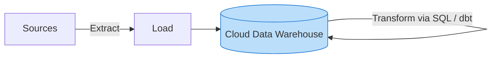

# 🔄 ELT (Extract, Load, Transform)

**ELT** stands for Extract, Load, Transform. It is a modern data integration pattern that leverages the massive, scalable compute power of cloud Data Warehouses or Data Lakes to perform transformations **after** the data has been loaded.

## ⚙️ The Three Phases

### 1. 📥 Extract
- Data is pulled from source systems exactly as it is (raw format).

### 2. 📤 Load
- Data is immediately loaded into the target storage system (Cloud Data Warehouse or Data Lake).
- The storage system acts as a landing zone for raw data.

### 3. 🧮 Transform
- Transformations (cleaning, joining, aggregating) are executed using the destination's own compute engine (e.g., Snowflake, BigQuery) usually via SQL.
- Tools like **dbt (data build tool)** are extremely popular for managing these in-warehouse transformations.

## 🗺️ Flow Diagram

## ✅ Pros and ❌ Cons

* **Pros:** 
  * **Agility**: Raw data is immediately available in the warehouse. Data analysts can define new transformations without waiting for data engineers to change upstream ETL jobs.
  * **Scalability**: Utilizes the massive power of cloud compute.
  * **Simplicity**: Consolidates the technology stack (SQL is used for both querying and transforming).
* **Cons:** Cloud compute costs can spiral if inefficient SQL transformations are run frequently. Security requires careful role-based access control (RBAC) since raw, potentially sensitive data lives in the warehouse.

## 🏢 Use Case
**Modern Tech Analytics**: A startup uses managed ingestion (like Fivetran) to Extract and Load data from Salesforce, Zendesk, and Postgres directly into Snowflake. Analytics Engineers then use **dbt** to Transform that raw data into a Star Schema directly inside Snowflake for Looker dashboards.