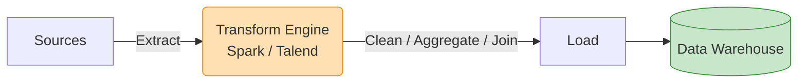

# 🏗️ ETL (Extract, Transform, Load)

**ETL** stands for Extract, Transform, Load. It is a traditional data integration process used to blend data from multiple sources, clean and format it, and then load it into a destination for analytical reporting.

In ETL, the data is transformed **before** it enters the destination storage.

## ⚙️ The Three Phases

### 1. 📥 Extract
- Data is pulled from various source systems (RDBMS, APIs, flat files, SaaS applications).
- Often involves capturing incremental changes (Change Data Capture - CDC) to minimize load times.

### 2. 🧮 Transform
- **The heaviest processing happens here.**
- **Cleaning**: Removing duplicates, handling missing values.
- **Formatting**: Date standardizations, string casing.
- **Enrichment**: Joining with other datasets.
- **Aggregation**: Summarizing daily sales, grouping by region.
- Typically executed on a dedicated processing server or framework (like Informatica, Talend, or Apache Spark).

### 3. 📤 Load
- The highly structured, transformed data is written into the target system (usually a Data Warehouse like Teradata, SQL Server, or Snowflake).

## 🗺️ Flow Diagram

## ✅ Pros and ❌ Cons

* **Pros:** Protects the destination Data Warehouse from heavy computational transformations. Data entering the warehouse is already pristine and ready for BI. Excellent for masking PII/sensitive data before it reaches the analytical layer.
* **Cons:** Rigid structure means if business users need raw data, they can't get it from the warehouse easily. Requires dedicated transformation infrastructure. Slower time-to-insight compared to ELT for massive raw datasets.