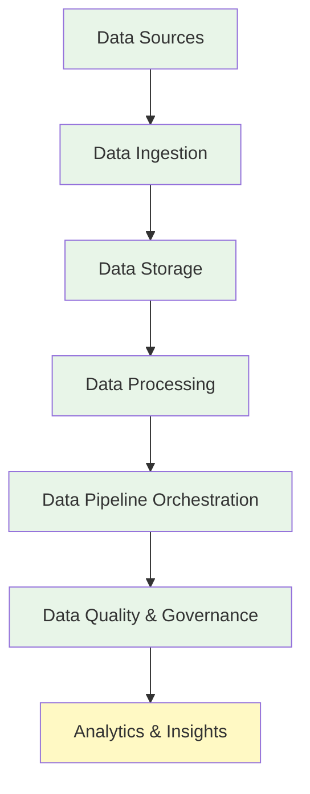
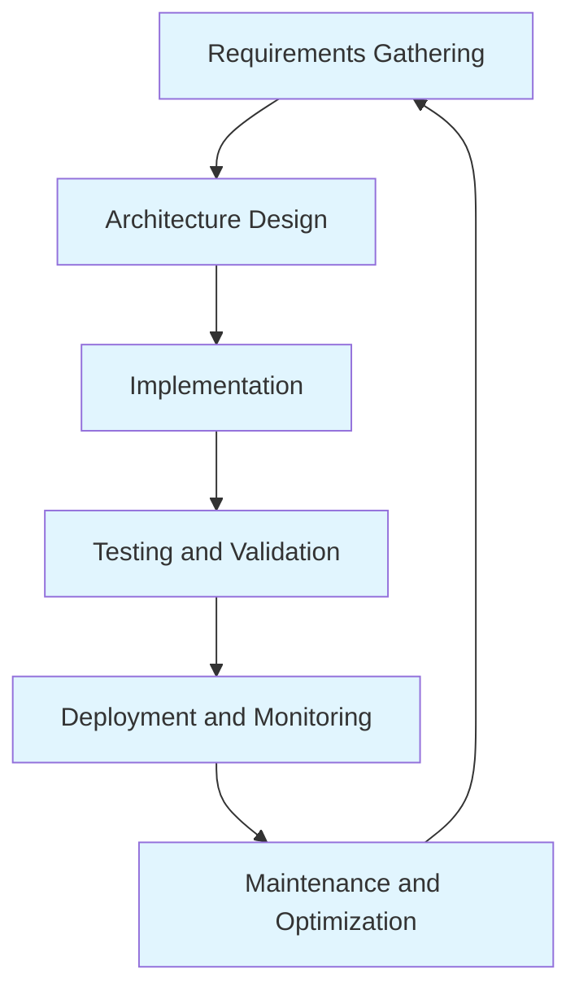
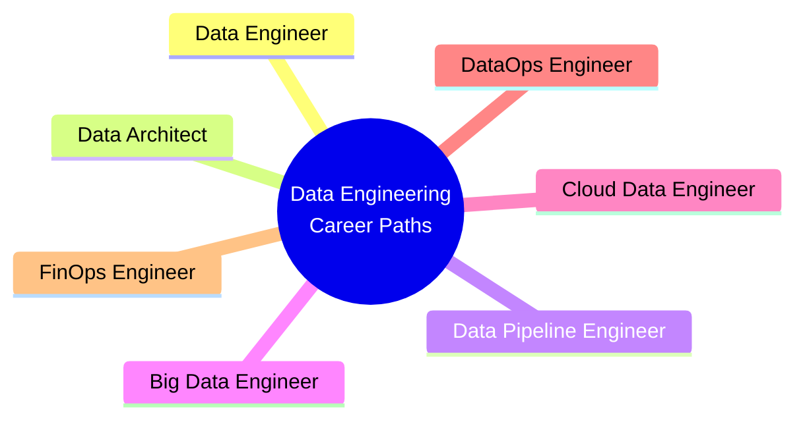
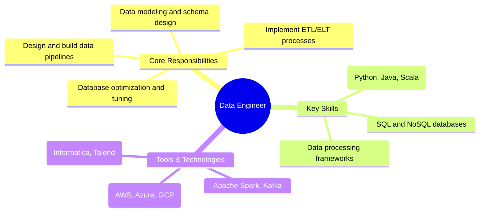
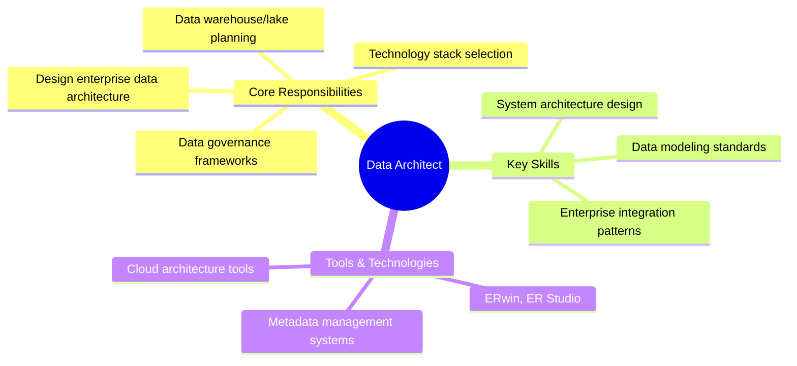
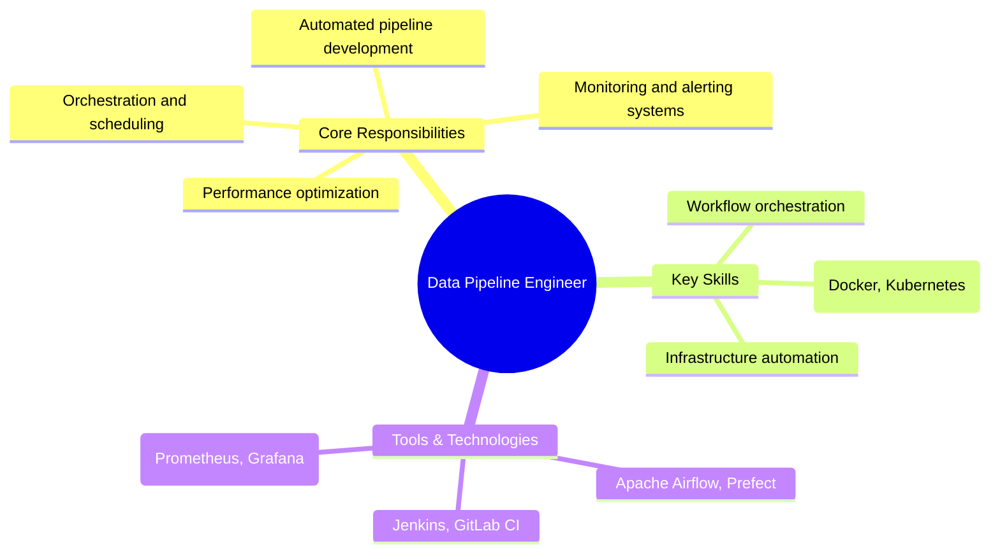
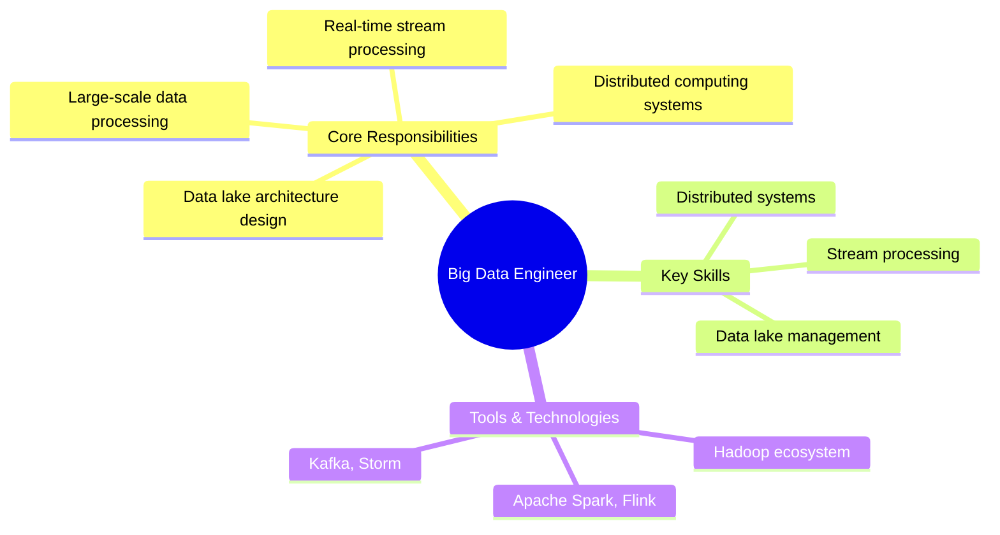
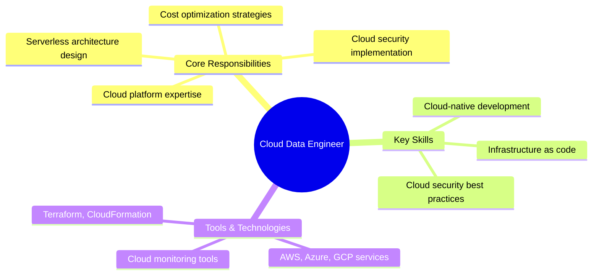
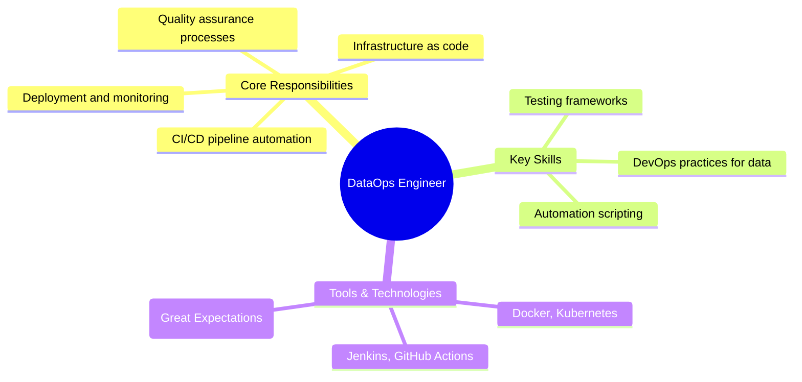
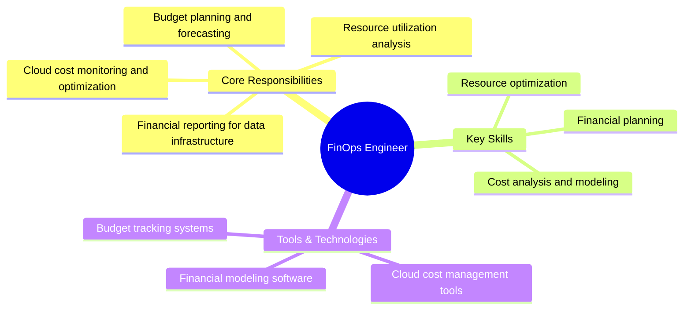

# Introduction to Data Engineering

## What is Data Engineering?

Data Engineering is a critical discipline in the modern data landscape that focuses on the design, construction, and maintenance of systems for collecting, storing, and analyzing large volumes of data. It serves as the foundation for data science, analytics, and business intelligence by ensuring that data is accessible, reliable, and ready for consumption.

## Why Data Engineering Matters

In an era where data is often called the "new oil," organizations generate massive amounts of data from various sources including applications, sensors, social media, and transactional systems. Data Engineering provides the infrastructure and processes needed to:

- **Collect** data from diverse sources
- **Store** data efficiently and securely
- **Process** and transform data for analysis
- **Ensure** data quality and governance
- **Enable** scalable analytics and insights

## Core Components of Data Engineering

### Data Ingestion
The process of collecting and importing data from various sources into a data storage system. This includes batch processing, real-time streaming, and API-based data collection.

### Data Storage
Choosing appropriate storage solutions based on data volume, velocity, and variety. This includes traditional databases, data warehouses, data lakes, and modern lakehouse architectures.

### Data Processing
Transforming raw data into usable formats through ETL (Extract, Transform, Load) or ELT processes, data cleansing, and enrichment.

### Data Pipeline Orchestration
Managing the flow of data through various processing stages using tools like Apache Airflow, Prefect, or cloud-native services.

### Data Quality and Governance
Implementing standards for data accuracy, consistency, security, and compliance with regulations like GDPR and CCPA.

## Data Engineering Lifecycle

1. **Requirements Gathering**: Understanding business needs and data sources
2. **Architecture Design**: Planning the data infrastructure and pipelines
3. **Implementation**: Building data pipelines and storage solutions
4. **Testing and Validation**: Ensuring data quality and system reliability
5. **Deployment and Monitoring**: Operating the system in production
6. **Maintenance and Optimization**: Continuous improvement and scaling

## Emerging Trends

- **Cloud-Native Data Engineering**: Leveraging cloud platforms for scalability and cost-efficiency
- **Real-Time Data Processing**: Streaming analytics and event-driven architectures
- **Data Mesh**: Decentralized data ownership and domain-oriented data products
- **Machine Learning Operations (MLOps)**: Integrating ML models into data pipelines
- **Data Fabric**: Unified data access across heterogeneous environments

## Career Opportunities

### High-Level Career Paths in Data Engineering

### Detailed Role Responsibilities

#### Data Engineer
---

#### Data Architect
---

#### Data Pipeline Engineer
---

#### Big Data Engineer
---

#### Cloud Data Engineer
---

#### DataOps Engineer
---

#### FinOps Engineer
---

This field continues to grow rapidly as organizations increasingly recognize the strategic importance of robust data infrastructure.