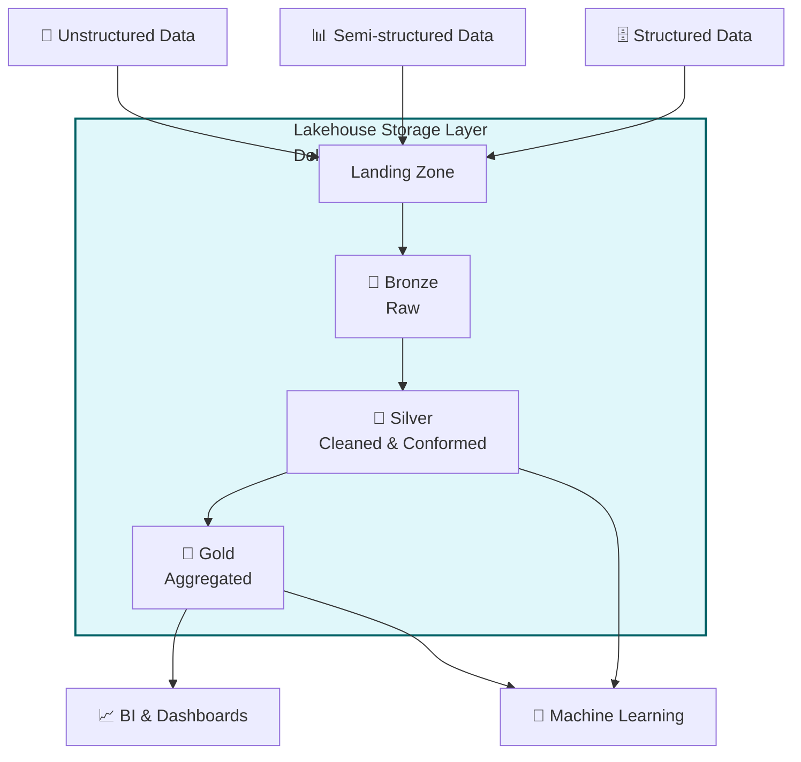

# 🌊🏠 Lakehouse Architecture

A **Data Lakehouse** is a modern data architecture that combines the best features of Data Lakes and Data Warehouses. It provides the flexibility, scale, and low cost of a data lake with the data management, schemas, and ACID transactions of a data warehouse.

## ✨ Core Capabilities

- 🔒 **ACID Transactions**: Ensures data reliability and consistency with concurrent reads/writes.
- 🗂️ **Schema Enforcement & Governance**: Prevents the "data swamp" problem by enforcing structure and quality at the storage level.
- 📊 **BI Support**: Connects directly to BI tools without needing to move data to a separate proprietary warehouse.
- 🤖 **Unified Workloads**: Handles Data Science, Machine Learning, and SQL Analytics on the exact same platform.
- 💾 **Open Storage Formats**: Uses open file formats like Apache Parquet or ORC, powered by modern table formats like **Delta Lake, Apache Iceberg, or Apache Hudi**.

## 🏗️ Architecture Comparison

| Feature | Data Lake | Data Warehouse | Data Lakehouse |
| :--- | :--- | :--- | :--- |
| **Data Types** | Structured, Semi, Unstructured | Structured | Structured, Semi, Unstructured |
| **Storage Cost** | Low | High | Low |
| **ACID Transactions** | No | Yes | Yes |
| **Performance for BI** | Slow / Complex | Fast | Fast |

## 🗺️ Flow Diagram

