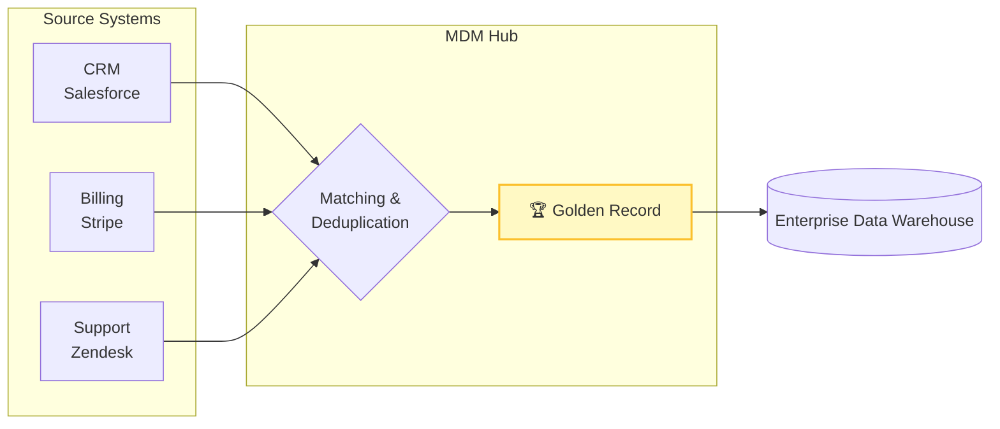

# 🥇 Master Data Management (MDM)

**Master Data Management (MDM)** is a technology-enabled discipline in which business and IT work together to ensure the uniformity, accuracy, stewardship, and accountability of the enterprise's official shared **Master Data**.

## 📝 What is Master Data?

Master Data represents the core business objects used across different applications. It changes slowly compared to transactional data (Fact data). 

- 🧑 **Parties**: Customers, Employees, Suppliers, Partners.
- 📦 **Things**: Products, Assets, Inventory items.
- 📍 **Places**: Store locations, Geographies, Warehouses.

## 🎯 The Core Concept: The "Golden Record"

In large organizations, the same customer might exist in the CRM (Salesforce), the Billing System (Stripe), and the Customer Support System (Zendesk). Often, the data is slightly different across all three (e.g., "Jon Doe" vs "Jonathan Doe").

MDM's primary goal is to resolve these identities and create a **Golden Record**—a single, trusted, comprehensive view of a master data entity.

## ⚙️ How MDM Works

1. **Data Collection**: Gather master data from disparate operational systems.
2. **Matching & Linking**: Use deterministic (exact match) and probabilistic (fuzzy match) algorithms to identify duplicate records.
3. **Survivorship Rules**: Decide which system's data "wins" when there is a conflict. *(e.g., "Always trust the CRM for the customer's legal name, but trust the Billing System for their billing address").*
4. **Publishing**: Syndicate the Golden Record down to the Data Warehouse, or push it back out to operational systems.

## 🗺️ Flow Diagram

