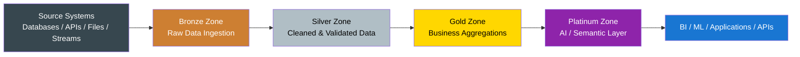
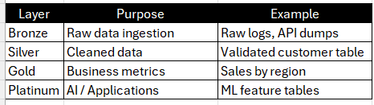
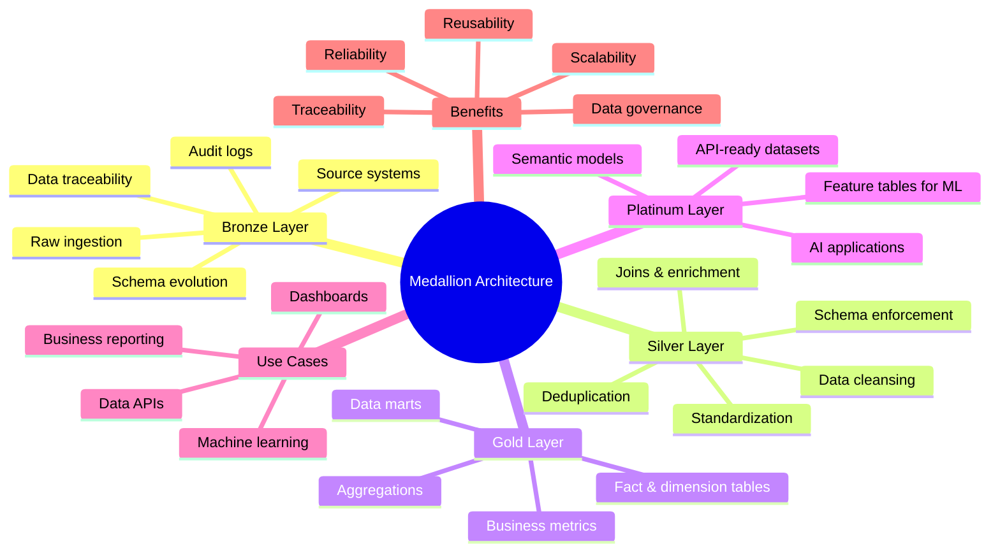

# Medallion Data Architecture

The Medallion Architecture (also called "multi-zone" or "delta architecture") is a layered data pattern that organizes storage and processing into Bronze, Silver, and Gold zones. Each zone represents a level of refinement and trust in the data.

## Layers
- 🥉 **Bronze Layer — Raw Zone**  --> The Bronze layer is the landing one for raw data coming directly from source systems.

  **Key Characteristics**
    * Contains raw, unprocessed data
    * Data is ingested as-is (CSV, JSON, logs, CDC streams, API dumps, oT events)
    * No cleaning, no transformation
    * Often partitioned by ingestion date/time
    * Used for data traceability and auditing
    * Supports schema evolution
    * Acts as a backup of original data

   **Data Sources**
  *  Data can come from:
     * Databases
     * APIs
     * Streaming systems
     * Log files
     * CSV/JSON files
     * IoT devices

   **Common Tasks**
   * Data ingestion
   * Basic metadata capture
   * Storing ingestion timestamps
   * Maintaining historical records

- 🥈 **Silver Layer — Cleansed / Conformed Zone**: The Silver layer contains cleaned, validated, and standardized data derived from the Bronze layer.

   **Key Characteristics**
   * Contains cleaned and validated data
   * Data quality checks are applied
   * Handles duplicates, null values, and incorrect formats
   * Standardizes data types and naming conventions
   * Combines data from multiple Bronze sources
   * Enforces basic business rules
   * Provides reliable datasets for further processing
   * Data becomes structured and analytics-ready

   **Typical Transformations**
   * Deduplication of records
   * Standardizing formats (dates, currencies, units)
   * Data type corrections
   * Handling missing or null values
   * Joining datasets from multiple sources
   * Data validation and filtering
   * Applying business rules

   **Data Sources**
   * Data primarily comes from:
     * Bronze layer datasets
     * Raw event streams
     * Application data
     * External data sources

   **Common Tasks**
     * Data cleaning and validation
     * Deduplication
     * Schema enforcement
     * Data standardization
     * Data enrichment
     * Integrating datasets from multiple sources

- 🥇 **Gold Layer — Business / Analytics Zone**: The Gold layer contains business-ready, highly curated datasets designed for reporting, dashboards, and advanced   analytics.

   **Key Characteristics**
   * Contains aggregated and business-level data
   * Optimized for analytics and reporting
   * Organized into fact and dimension tables
   * Highly curated and trusted datasets
   * Designed for fast query performance
   * Used directly by business users and analysts
   *  Often represents KPIs and business metrics

   **Typical Data Models**
   * Fact tables
   * Dimension tables
   * Aggregated datasets
   * Data marts
   * KPI tables
   * Feature tables for machine learning
      
   **Data Sources**
   * Data is derived from:
   * Silver layer datasets
   * Cleaned and validated enterprise data

   **Common Tasks**
   * Data aggregation
   * Business metric calculations
   * Creating fact and dimension tables
   * Building data marts
   * 0Preparing datasets for dashboards
   * Preparing features for machine learning

 💎 **Platinum Layer — Semantic / AI / Serving Zone**: The Platinum layer is the highest level of data refinement, designed for advanced analytics, machine learning models, semantic layers, and application APIs.

   **Key Characteristics**
   * Built on top of Gold datasets
   * Contains domain-specific or application-ready datasets
   * Optimized for AI, ML, and operational use cases
   * Often contains feature tables or semantic models
   * Used by applications, AI systems, and advanced analytics
   * Very highly curated and governed

  **Typical Data Models**
   * Machine learning feature tables
   * Semantic models
   * API-ready datasets
   * AI feature stores
   * Real-time serving tables
   * Recommendation datasets

  **Data Sources**
  * Data is derived from:
  * Gold layer datasets
  * Business metrics and curated data marts

  **Common Tasks**
  * Feature engineering for ML models
  * Semantic layer creation
  * Data product creation
  * API dataset preparation
  * Real-time serving datasets
  * Advanced analytics datasets

## Flow Diagram

## Mind Map

## Business Examples

**Finance**

  * Use case: Fraud detection and financial transaction analytics

    **Bronze**

    * Raw transaction logs from ATMs, POS systems, mobile banking, card networks
    * Account activity feeds
    * Payment gateway events

     **Silver**

    * Cleaned and normalized transaction records
    * Duplicate removal and validation
    * Customer-account mapping
    * Fraud indicators and suspicious pattern tagging

    **Gold**

    * Risk scoring datasets
    * Fraud monitoring dashboards
    * Daily transaction summaries
    * Customer spending behavior reports
    
    **Why it matters in finance**

    * Financial data arrives from many systems
    * Auditability is critical
    * Raw data must be preserved for compliance and investigation

**Healthcare**

  * Use case: Patient record unification and healthcare analytics

    **Bronze**
    * EHR exports
    * Lab reports
    * Insurance claims
    * Pharmacy records
    * Device or monitoring data

    **Silver**

    * Standardized patient data
    * Patient identity matching
    * Cleaned diagnosis and treatment records
    * Validated encounter history

    **Gold**

    * Consolidated patient profiles
    * Hospital performance dashboards
    * Readmission analytics
    * Population health metrics

    **Why it matters in healthcare**

    * Data comes from disconnected systems
    * Patient identity may appear differently across sources
    * High-quality data is required for analytics and decision-making

**Retail**
  * Use case: Sales performance and customer analytics

    **Bronze**
    * POS transactions
    * Webstore clickstream events
    * Product feeds
    * Inventory files
    * Loyalty program activity

    **Silver**
    * Standardized sales records
    * Cleaned customer and product data
    * Joined inventory and sales datasets
    * Validated order and return records

    **Gold**
    * Daily and weekly sales summaries
    * Product performance reports
    * Customer segmentation datasets
    * BI dashboards for revenue and trends

    **Why it matters in retail**

    * Data comes from stores, websites, suppliers, and promotions
    * Raw data may be inconsistent
    * Business teams need trusted reporting datasets

**Oil & Gas**
  * Use case: Production monitoring and operational analytics

    **Bronze**
    * Sensor data from wells and pipelines
    * Drilling logs
    * Equipment maintenance logs
    * Production reports
    * Shipment and inventory records

    **Silver**
    * Cleaned sensor readings
    * Standardized field, well, and equipment data
    * Validated production measurements
    * Joined operational and maintenance data

    **Gold**
    * Production dashboards
    * Equipment performance analytics
    * Maintenance planning reports
    * Field-level profitability summaries

    **Why it matters in oil & gas**
    * Large volume of machine-generated and operational data
    * Data quality is essential for safety and planning
    * Historical raw data is useful for audit and engineering analysis

**Power / Energy**
  * Use case: Power generation, consumption, and grid analytics

    **Bronze**
    * Smart meter readings
    * Grid sensor data
    * Power plant generation logs
    * Outage records
    * Billing and customer consumption data

    **Silver**
    * Cleaned and time-aligned meter data
    * Standardized customer and facility records
    * Validated outage and generation events
    * Joined operational and billing datasets

    **Gold**
    * Energy usage dashboards
    * Load forecasting datasets
    * Plant performance summaries
    * Customer billing and consumption analytics

    **Why it matters in power**
    * Huge volume of time-series data
    * Real-time and batch data must be managed together
    * Trusted data is needed for planning, billing, and operational decisions

**Pharmaceuticals**

  * Use case: Drug manufacturing, quality, and supply chain analytics

    **Bronze**
    * Batch manufacturing records
    * Lab test results
    * Clinical trial feeds
    * Supply chain and shipment logs
    * Regulatory reporting data

    **Silver**
    * Cleaned batch and product records
    * Standardized trial and lab data
    * Quality validation checks
    * Joined manufacturing, testing, and supply data

    **Gold**
    * Quality compliance dashboards
    * Batch performance summaries
    * Clinical analytics datasets
    * Supply chain monitoring reports

    **Why it matters in pharmaceuticals**
    * Data accuracy and traceability are extremely important
    * Regulatory compliance requires strong lineage
    * Multiple teams need trusted, business-ready data

**Advantages of Medallion Architecture**
* Clear separation of data stages

  * Bronze keeps raw data
  * Silver improves data quality
  * Gold prepares data for business use

* Better data quality

  * Errors, duplicates, and missing values can be handled in Silver before reaching Gold

* Easier debugging

  * Teams can trace problems back to the raw layer and identify where issues were introduced

* Supports audit and compliance

  * Original raw data is preserved

  * Useful for regulated industries like finance, healthcare, oil & gas, and pharma

* Easier reprocessing

  * If transformation logic changes, data can be replayed from Bronze

* Reusable datasets

  * Multiple Gold datasets can be built from the same Silver layer

* Scales well for enterprise systems

  * Works well when data grows from small to very large volumes

* Supports multiple use cases

  * Reporting
  * Dashboards
  * Advanced analytics
  * Machine learning
  * Data sharing across teams

**Implementation Notes**

   **Common platforms**
  * Databricks / Delta Lake
  * Snowflake
  * AWS S3 + Spark / Glue
  * Azure Data Lake + Databricks / Synapse
  * GCP Cloud Storage + Dataproc / BigQuery

   **Common processing engines**
  * Apache Spark
  * Databricks
  * Snowflake pipelines
  * AWS Glue
  * Azure Data Factory + Synapse
  * dbt for transformations in warehouse-based models

   **Common orchestration tools**
  * Airflow
  * Prefect
  * Azure Data Factory pipelines
  * AWS Step Functions
  * Dagster

   **Design practices**
  * Keep Bronze as close to source as possible
  * Apply cleaning, deduplication, and standardization in Silver
  * Build business-focused aggregated datasets in Gold
  * Maintain metadata, lineage, and timestamps
  * Add validation and quality checks at each layer

   **Storage guidance**
   * Bronze data is usually append-only
   * Silver may contain cleaned and merged datasets
   * Gold is optimized for reporting, KPIs, and analytics

   **Governance guidance**
   * Track data lineage
   * Apply schema validation
   * Control access by layer
   * Maintain audit history for sensitive domains