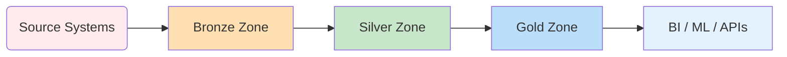
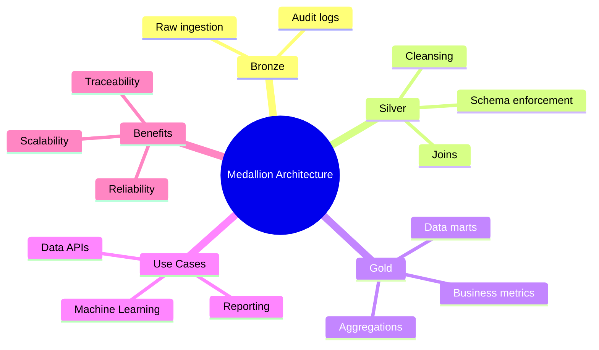

# Medallion Data Architecture

The Medallion Architecture (also called "multi-zone" or "delta architecture") is a layered data pattern that organizes storage and processing into Bronze, Silver, and Gold zones. Each zone represents a level of refinement and trust in the data.

## Layers
- 🥉 **Bronze Layer — Raw Zone**  --> The Bronze layer is the landing zone for raw data coming directly from source systems.

    **Key Characteristics**

      * Contains raw, unprocessed data
      * Data is ingested as-is (CSV, JSON, logs, CDC streams, API dumps, IoT events)
      * No cleaning, no transformation
      * Often partitioned by ingestion date/time
      * Used for data traceability and auditing
      * Supports schema evolution
      * Acts as a backup of original data

    **Data Sources**

        * Data can come from:

          * Databases

          * APIs

          * Streaming systems

          * Log files

          * CSV/JSON files

          * IoT devices

     **Common Tasks**

        * Data ingestion

        * Basic metadata capture

        * Storing ingestion timestamps

Maintaining historical records
- 🥈 **Silver**: Cleansed and conformed data; transformations applied
- 🥇 **Gold**: Business-grade, aggregated, and ready for analytics or serving

## Flow Diagram

## Mind Map

## Business Examples

### Finance
- **Use case**: Fraud detection pipeline
  * Bronze: transaction logs from ATMs, POS
  * Silver: normalized transactions with fraud flags
  * Gold: aggregated risk scores for dashboards

### Healthcare
- **Use case**: Patient record unification
  * Bronze: EHR exports, lab results, insurance claims
  * Silver: matching patient identities, cleaning
  * Gold: consolidated patient profiles used for analytics

### Retail
- **Use case**: Sales performance analytics
  * Bronze: raw POS and webstore events
  * Silver: standardized sales records, product catalogs
  * Gold: daily/weekly sales summaries for BI reports

## Advantages
- Clear separation of concerns
- Easier rollback and replay with raw data retention
- Supports multiple downstream consumers with varying trust requirements

## Implementation Notes
- Often implemented on Delta Lake (Databricks), Snowflake, or S3 with processing engines like Spark
- Automate with orchestration tools (Airflow, Prefect)

> The medallion architecture is especially valuable in environments with diverse data sources and strong requirements for auditability and reproducibility.