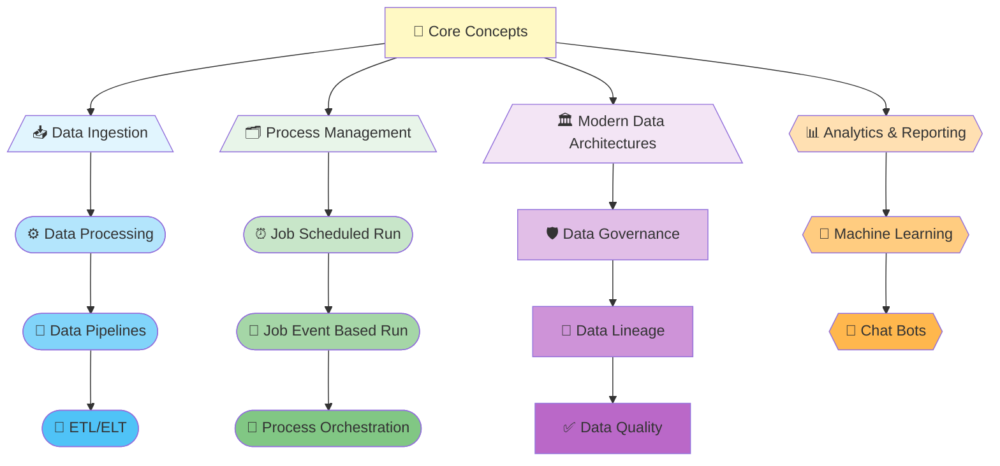

# Learning Objectives

By the end of this comprehensive Data Engineering training program, participants will achieve the following key objectives:

## Core Data Engineering Concepts
- 📘 Understand the fundamental concepts and principles of data engineering
- 🌐 Learn the role of data engineering in the modern data ecosystem
- 🔄 Comprehend the data engineering lifecycle and best practices

**Real-World Use Cases:**
- **Finance**: Banks processing millions of daily transactions to detect fraud patterns
- **Healthcare**: Aggregating patient data from multiple systems for disease analysis
- **Retail**: Consolidating sales data from thousands of stores for inventory optimization

## Data Ingestion and Processing
- ☁️ Learn about various data ingestion techniques (batch, real-time, streaming)
- 🗄️ Understand data storage solutions and architectures
- ⚙️ Explore data processing frameworks and technologies
- 📥 Master data collection from APIs, databases, files, and streaming sources
- 🧩 Learn to handle structured, semi-structured, and unstructured data

**Real-World Use Cases:**
- **E-commerce**: Real-time ingestion of customer clickstream data for personalized recommendations
- **Manufacturing**: Collecting sensor data from IoT devices on production lines for quality monitoring
- **Media & Entertainment**: Processing user behavior data from streaming platforms for content recommendations

## ETL/ELT and Data Pipelines
- 🧱 Master ETL (Extract, Transform, Load) and ELT processes and understand when to use each
- 🔁 Learn data pipeline orchestration and workflow management
- 🧼 Understand data transformation and cleansing techniques
- ✅ Handle data validation, deduplication, and enrichment
- 🔄 Learn error handling and retry mechanisms for robust pipelines

**Real-World Use Cases:**
- **Banking**: ETL processes that consolidate data from legacy systems into modern data warehouses
- **Telecommunications**: ETL pipelines that transform CDR (Call Detail Records) for billing accuracy
- **Government**: ELT processes for real-time analysis of public service delivery data

## Process Management & Job Orchestration
- 🕒 Learn job scheduling and task automation frameworks
- 📅 Understand event-based and scheduled job execution models
- 🛠️ Master orchestration tools for managing complex data workflows
- 🔗 Learn dependency management and error recovery strategies
- 🚨 Handle monitoring and alerting for data pipeline health

**Real-World Use Cases:**
- **Insurance**: Automated daily batch processing of claims for timely settlement
- **Logistics**: Real-time event-driven pipelines triggered by shipment updates
- **Energy Sector**: Scheduled orchestration of meter readings collection and billing processes

## Modern Data Architectures
- 🏛️ Familiarize with contemporary data architectures including Data Lakes, Lakehouse, Data Mesh, and Data Fabric
- 🛡️ Understand data governance and metadata management
- 🧭 Learn data lineage tracking for compliance and debugging
- 🔍 Master data quality frameworks and monitoring
- 📚 Implement data catalogs for discoverability and usage tracking

**Real-World Use Cases:**
- **Pharmaceutical**: Data governance frameworks ensuring HIPAA compliance for clinical trial data
- **Financial Services**: Data lineage tracking for regulatory audits and risk assessment
- **Automotive**: Data quality checks for sensor data from connected vehicles to ensure safety

## Cloud-Based Data Engineering
- ☁️ Learn cloud-native data engineering with major platforms: AWS, Azure, and GCP
- ⚡ Understand serverless data processing and managed services
- 💰 Master cloud cost optimization and scalability patterns
- 🛠️ Learn to leverage cloud-native tools like Lambda, Cloud Functions, and Dataflow
- 🔒 Understand security and encryption in cloud platforms

**Real-World Use Cases:**
- **Streaming Services**: Netflix-style platforms using cloud infrastructure for petabyte-scale data processing
- **Social Media**: Real-time processing of billions of events using cloud data warehouses
- **SaaS Companies**: Cost-optimized data pipelines using serverless architectures

## Analytics and Reporting
- 📊 Understand data analytics fundamentals and statistical concepts
- 📈 Learn reporting and visualization techniques for business intelligence
- 🔗 Comprehend the integration of data engineering with business intelligence
- 🧑‍🤝‍🧑 Master self-service analytics and data democratization
- 💡 Learn to create actionable insights from raw data

**Real-World Use Cases:**
- **Retail**: Dashboard analytics showing real-time sales performance across all locations
- **Healthcare**: Predictive analytics identifying high-risk patient groups for preventive care
- **Education**: Reporting and visualization of student performance metrics for institutional improvement

## Machine Learning Integration
- 🤖 Understand the intersection of data engineering and machine learning
- 🛠️ Learn feature engineering and data preparation for ML models
- 🚀 Master model deployment pipelines and continuous training systems
- ⚖️ Learn A/B testing frameworks and performance monitoring
- 📋 Understand MLOps and model governance

**Real-World Use Cases:**
- **E-commerce**: Recommendation engines processing terabytes of customer data
- **Finance**: Fraud detection models requiring real-time feature computation
- **Healthcare**: Chatbots and diagnostic systems requiring continuous model retraining

## Practical Skills
- 🛠️ Develop hands-on experience with data engineering tools and technologies
- 🧱 Learn to design, implement, and maintain data pipelines
- 🧠 Gain proficiency in troubleshooting and optimizing data systems
- 💼 Practice with industry-standard tools and programming languages
- 📁 Build portfolio projects using real datasets

Upon completion, participants will be equipped to design and implement robust data engineering solutions that support organizational data needs and drive data-driven decision making across industries.