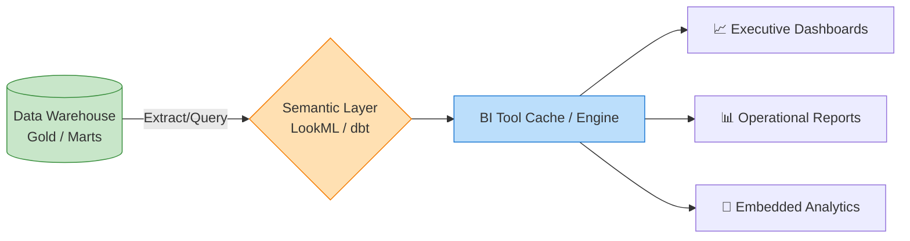

# 📊 Reporting & Business Intelligence (BI)

**Reporting** and Business Intelligence (BI) represent the consumption layer of the data engineering lifecycle. It is the process of presenting structured, curated data to business stakeholders in the form of dashboards, scorecards, and tabular reports to drive operational and strategic decision-making.

For a Data Engineer, the reporting layer is the ultimate "customer." Your data pipelines, warehouses, and modeling efforts exist to make this layer fast, accurate, and reliable.

## 🎯 Key Concepts

- **Dashboards vs. Reports**: 
  - *Dashboards* provide a high-level, interactive, visual summary of KPIs (Key Performance Indicators) tailored for quick consumption.
  - *Reports* are usually highly detailed, tabular, and often paginated or exported (e.g., a massive Excel file of daily transactions).
- **The Semantic Layer**: A business representation of the data. It translates technical database column names (`cust_id_fk`, `trx_amt`) into business-friendly terms ("Customer Name", "Total Revenue") and centralizes the logic for metric calculations.
- **Self-Service BI**: Empowering non-technical business users to drag-and-drop dimensions and metrics to build their own reports without writing SQL or waiting on the IT team.

## ⚙️ The Data Engineer's Role in Reporting

During an interview, emphasize that you don't just "build pipelines"; you optimize them for BI tools:
1. 🚀 **Query Performance**: BI tools need sub-second response times. Data engineers achieve this by building **Aggregated/Gold Tables**, **Materialized Views**, and denormalizing data (e.g., using Star Schemas).
2. 🔄 **Data Freshness**: Ensuring the pipeline meets the business SLA (Service Level Agreement). If the CEO reviews a dashboard at 8:00 AM, the nightly batch job must successfully finish by 7:30 AM.
3. 🔐 **Data Security (RLS)**: Implementing Row-Level Security so that a Regional Sales Manager only sees data for their specific region when they log into the dashboard.

## 🗺️ BI Flow Diagram

## 🛠️ Industry Standard BI Tools

- **Enterprise Platforms**: Tableau, Microsoft Power BI, Looker, Qlik.
- **Open Source / Modern BI**: Apache Superset, Metabase, Lightdash.
- **Traditional Reporting**: SSRS (SQL Server Reporting Services), Cognos, Crystal Reports.

## 🗣️ Interview Talking Point
*"To optimize the reporting layer, I focus on pushing heavy transformations upstream into the Data Warehouse using dbt, creating a dedicated Star Schema or pre-aggregated 'Gold' tables. This prevents the BI tool (like Tableau or Power BI) from choking on complex SQL joins at runtime, resulting in significantly faster dashboard load times and a better experience for the business."*