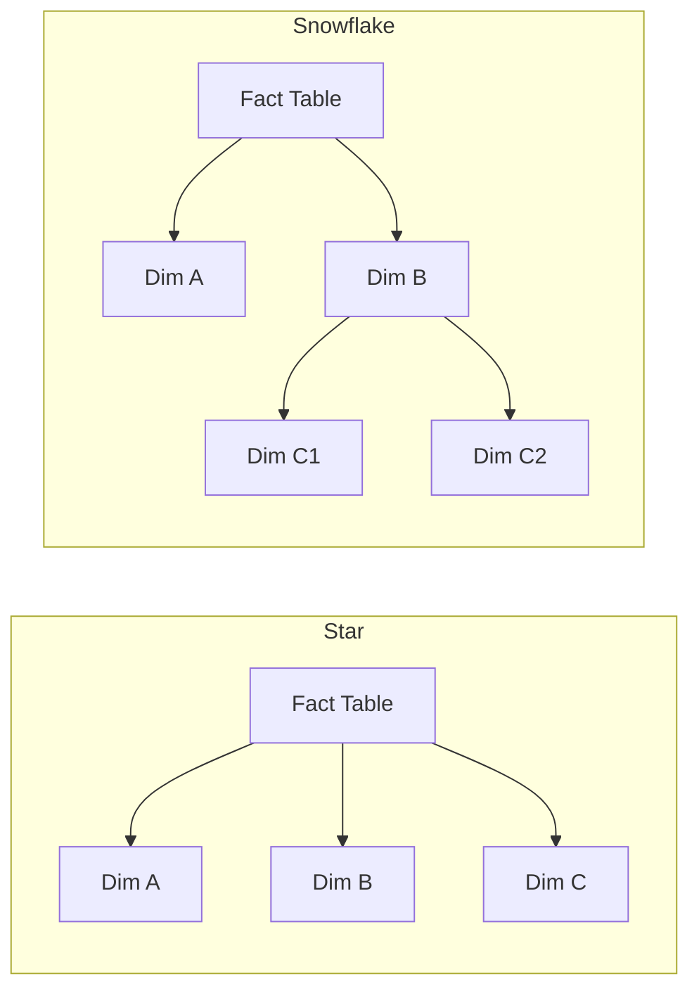
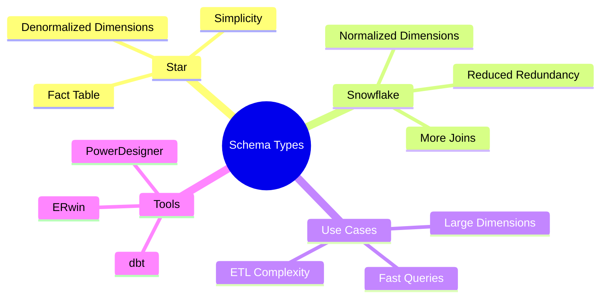

# Star and Snowflake Schemas

These are data modeling techniques used within data warehouses to organize facts (measurements) and dimensions (context) for efficient querying.

## Star Schema
- Central **fact table** surrounded by denormalized **dimension tables**
- Easy to understand and query; common in BI workloads
- Dimensions contain redundant data to avoid joins

## Snowflake Schema
- Similar to star but dimensions are normalized into multiple related tables
- Reduces redundancy but increases join complexity

## Comparison Diagram

## Mind Map

## Business Examples

### Retail
- **Use case**: Sales analytics
  * Star schema with fact_sales, dim_store, dim_product, dim_time
  * Snowflake variant normalizes dim_product into category and subcategory tables

### Healthcare
- **Use case**: Patient encounter reporting
  * Star schema with fact_encounter, dim_patient, dim_provider, dim_diagnosis
  * Snowflake leads to separate dim_diagnosis and dim_treatment hierarchies

### Finance
- **Use case**: Trading analysis
  * Star schema for trades/facts with dimensions for accounts, instruments, time
  * Snowflake used when instrument classification hierarchy is deep

## Implementation Notes
- Schema choice balances query performance vs. storage efficiency
- Modern analytic engines often flatten snowflake joins automatically

> Star schemas are common for end-user facing reports, while snowflake schemas suit complex dimensional hierarchies and large normalization needs.