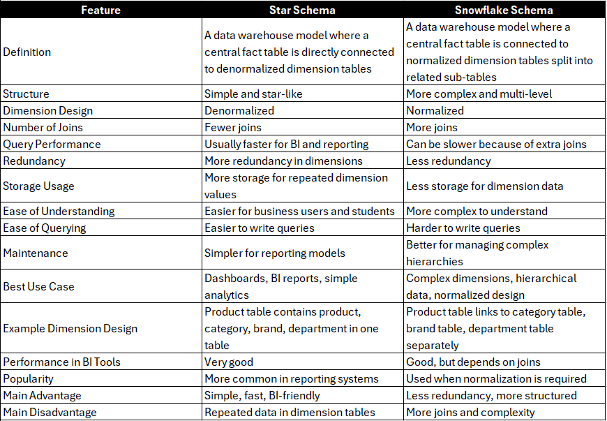

# Star and Snowflake Schemas

These are data modeling techniques used in a Data Warehouse to organize data for reporting, analytics, and BI queries.

They help separate:
* Facts = measurable business events or numbers
* Dimensions = descriptive context around those facts

**Example:**
* Fact = sales amount
* Dimensions = product, customer, store, date

## Star Schema

* A Star Schema has one central fact table connected directly to multiple dimension tables.

**The structure looks like a star:**

* fact table in the center
* dimensions around it

**Main characteristics**

* Central fact table surrounded by denormalized dimension tables
* Easy to design and understand
* Fewer joins during queries
* Very common in BI and dashboard systems

### Structure

**Fact table**

Stores measurable values such as:

* sales amount
* quantity sold
* discount
* profit
* transaction count

### Dimension tables

Store descriptive details such as:

* product name, category, brand
* customer name, city, segment
* store name, region
* date, month, quarter, year

### Why it is called denormalized

A dimension table may keep repeated descriptive values to make reporting easier and faster.

For example, one product dimension may include:

* product_id
* product_name
* category_name
* department_name
* brand_name

Instead of splitting these into many smaller tables, they are kept together.

### Advantages of Star Schema
* Simple and easy to understand
* Fast query performance for reporting
* Fewer joins
* Good for dashboards and BI tools
* Business users can understand it easily

### Disadvantages of Star Schema
* More redundancy in dimension tables
* Repeated values take more storage
* Data maintenance may be less strict than normalized designs

**Talking point**

* Star Schema is best when you want simple, fast, and business-friendly reporting.

## Snowflake Schema

A Snowflake Schema is similar to a Star Schema, but the dimension tables are normalized into multiple related tables.

Instead of one large dimension table, the data is split into smaller connected tables.

### Main characteristics

* Central fact table still exists
* Dimension tables are broken into sub-dimensions
* Reduces redundancy
* Requires more joins

### Example

Instead of storing everything in one product dimension:

### Star style
**dim_product**
* product_id
* product_name
* brand_name
* category_name
* department_name

### Snowflake style
**dim_product**
* product_id
* product_name
* brand_id
* category_id

**dim_brand**
* brand_id
* brand_name

**dim_category**
* category_id
* category_name
* department_id

**dim_department**
* department_id
* department_name

So dimension data is separated into related tables.

### Advantages of Snowflake Schema
* Less redundancy
* Better normalization
* Cleaner data structure
* Easier to maintain some dimension hierarchies
* Good when dimensions are large and complex

### Disadvantages of Snowflake Schema
* More joins
* More complex queries
* Harder for business users to understand
* Can reduce query performance in some BI workloads

**Talking point**
* Snowflake Schema is best when dimensions are complex and reducing redundancy is important.

## Star Schema vs Snowflake Schema

Both are data warehouse modeling techniques used to organize fact tables and dimension tables for analytics and reporting.



## Comparison Diagram
```mermaid
flowchart LR
    subgraph Star_Schema[Star Schema]
        F1[Fact Table]
        D1[Dim Product]
        D2[Dim Customer]
        D3[Dim Date]
        D4[Dim Store]

        F1 --> D1
        F1 --> D2
        F1 --> D3
        F1 --> D4
    end
    style F1 fill:#FFD166,stroke:#E5E7EB,stroke-width:1.5px,color:#111827
    style D1 fill:#BFE7D0,stroke:#E5E7EB,stroke-width:1.5px,color:#111827
    style D2 fill:#BFE7D0,stroke:#E5E7EB,stroke-width:1.5px,color:#111827
    style D3 fill:#BFE7D0,stroke:#E5E7EB,stroke-width:1.5px,color:#111827
    style D4 fill:#BFE7D0,stroke:#E5E7EB,stroke-width:1.5px,color:#111827   
 ``` 
```mermaid
flowchart LR
    subgraph Snowflake_Schema[Snowflake Schema]
        F2[Fact Table]
        SD1[Dim Product]
        SD2[Dim Customer]
        SD3[Dim Date]
        SD4[Dim Store]

        P1[Category]
        P2[Brand]
        C1[City]
        C2[Region]

        F2 --> SD1
        F2 --> SD2
        F2 --> SD3
        F2 --> SD4

        SD1 --> P1
        SD1 --> P2
        SD2 --> C1
        C1 --> C2
    end
    style F2 fill:#FFD166,stroke:#E5E7EB,stroke-width:1.5px,color:#111827
    style SD1 fill:#CFE3FA,stroke:#E5E7EB,stroke-width:1.5px,color:#111827
    style SD2 fill:#CFE3FA,stroke:#E5E7EB,stroke-width:1.5px,color:#111827
    style SD3 fill:#CFE3FA,stroke:#E5E7EB,stroke-width:1.5px,color:#111827
    style SD4 fill:#CFE3FA,stroke:#E5E7EB,stroke-width:1.5px,color:#111827
    style P1 fill:#E9D5FF,stroke:#E5E7EB,stroke-width:1.5px,color:#111827
    style P2 fill:#E9D5FF,stroke:#E5E7EB,stroke-width:1.5px,color:#111827
    style C1 fill:#E9D5FF,stroke:#E5E7EB,stroke-width:1.5px,color:#111827
    style C2 fill:#E9D5FF,stroke:#E5E7EB,stroke-width:1.5px,color:#111827
 ``` 


## Mind Map
```mermaid
mindmap
  root((Star vs Snowflake))
    Star Schema
      Easy to Understand
      Fewer Joins
      Faster Reporting
      More Redundancy
    Snowflake Schema
      Normalized Design
      Less Redundancy
      More Joins
      More Complex
    Best For
      Dashboards
      BI Queries
      Complex Dimensions
      Hierarchies
``` 

## Business Examples

### Finance
Trading analysis, financial reporting, and risk analytics

#### Star Schema approach

A finance warehouse may use:

* fact_trades
* dim_account
* dim_instrument
* dim_time
* dim_branch

In this design:

* the fact table stores measures such as trade amount, quantity, fees, and profit/loss

* the dimension tables provide business context like account, customer, instrument, and date

#### Snowflake Schema approach

If the instrument dimension becomes complex, it may be normalized into:

* dim_instrument
* dim_asset_class
* dim_sector
* dim_exchange
* dim_region

#### Why this matters
* Star Schema is useful for simple and fast reporting dashboards
* Snowflake Schema is useful when financial product classification is deep and hierarchical

#### Talking point
* Finance often starts with a Star Schema for reporting, but Snowflake is useful when instrument or account hierarchies become more complex.

### Healthcare

Patient encounter reporting, claims analytics, and treatment analysis

#### Star Schema approach

A healthcare warehouse may use:

* fact_encounter
* dim_patient
* dim_provider
* dim_time
* dim_diagnosis
* dim_department

In this design:
* the fact table stores encounter cost, treatment count, claim amount, or visit duration
* the dimensions describe patient, provider, diagnosis, and time

#### Snowflake Schema approach

If diagnosis and treatment structures are detailed, the design may normalize into:
* dim_diagnosis
* dim_diagnosis_group
* dim_treatment
* dim_treatment_category
* dim_provider_specialty

#### Why this matters
* Star Schema makes patient and claims reporting easier
* Snowflake Schema helps manage complex clinical hierarchies and coded classifications

#### Talking point
* Healthcare uses Star Schema for fast reporting, but Snowflake becomes useful when diagnosis and treatment hierarchies need more structured modeling.

### Retail

Sales analytics, product reporting, and store performance dashboards

#### Star Schema approach

A retail warehouse may use:

* fact_sales
* dim_store
* dim_product
* dim_customer
* dim_time

In this design:
* the fact table stores measures like quantity sold, sales amount, discount, and profit
* the dimensions provide context such as store, product, customer, and date

#### Snowflake Schema approach

The product dimension may be normalized into:
* dim_product
* dim_category
* dim_subcategory
* dim_brand
* dim_supplier

#### Why this matters

* Star Schema is very common for sales dashboards and BI reports
* Snowflake Schema is useful when product hierarchies and master data are large

#### Talking point

* Retail reporting often uses Star Schema because it is easy to query, but Snowflake helps when product structures become more detailed.

### Oil & Gas

Production analytics, asset reporting, and field performance analysis

#### Star Schema approach

An oil & gas warehouse may use:

* fact_production
* dim_field
* dim_well
* dim_time
* dim_product
* dim_facility

In this design:
* the fact table stores production volume, operating cost, downtime, or shipment quantity
* the dimensions describe field, well, facility, and date

#### Snowflake Schema approach

If operational hierarchies are complex, dimensions may be normalized into:
* dim_well
* dim_field
* dim_region
* dim_asset_type
* dim_equipment_category

#### Why this matters
* Star Schema supports production dashboards and management reports
* Snowflake Schema fits detailed engineering and operational hierarchies

#### Talking point

* Oil & Gas often uses Star Schema for executive reporting, while Snowflake is helpful when field, well, and equipment relationships are deeper.

### Power / Energy

Consumption analysis, generation reporting, and outage trend analytics

#### Star Schema approach

* A power warehouse may use:
* fact_meter_reading_summary
* fact_billing
* dim_customer
* dim_meter
* dim_time
* dim_facility

In this design:
* the fact table stores usage units, bill amount, outage duration, or generation totals
* the dimensions describe customer, meter, plant, and date

#### Snowflake Schema approach
If geography or rate plans are complex, dimensions may be normalized into:

* dim_customer
* dim_city
* dim_region
* dim_rate_plan
dim_tariff_category

#### Why this matters
* Star Schema is good for billing and usage dashboards
* Snowflake Schema is better when geography, tariffs, and rate structures are large

#### Talking point
* Power companies use Star Schema for reporting and Snowflake when tariff or location hierarchies are more complex.

### Pharmaceuticals

Batch reporting, quality analytics, and product performance reporting

#### Star Schema approach
* A pharmaceutical warehouse may use:
* fact_batch_quality
* fact_sales
* dim_product
* dim_batch
* dim_time
* dim_facility

In this design:
* the fact table stores quality score, defect count, output volume, or product sales
* the dimensions provide product, batch, time, and site details

#### Snowflake Schema approach
If product and compliance dimensions are complex, the model may normalize into:

* dim_product
* dim_drug_category
* dim_therapeutic_class
* dim_regulatory_group
* dim_batch_stage

#### Why this matters
Star Schema supports quality dashboards and product performance reporting
* Snowflake Schema is useful when drug classifications and compliance structures are deep

#### Talking point

* Pharmaceutical reporting often uses Star Schema for fast analysis, but Snowflake helps organize complex product and regulatory hierarchies.

## Implementation Notes
* **Schema choice is a trade-off**  between query speed, simplicity, storage efficiency, and maintenance complexity.
* **Star Schema** is usually preferred for BI dashboards, self-service analytics, and end-user reporting because it is simpler and requires fewer joins.
* **Snowflake Schema** is preferred when dimensions are large, hierarchical, and need stronger normalization to reduce redundancy.
* Modern cloud analytics platforms such as **Snowflake, BigQuery, Redshift, Synapse, and Databricks SQL** can often optimize or flatten snowflake joins during query execution.
* Because of these engine optimizations, the performance gap between Star and Snowflake may be smaller than in older warehouse systems.
* **ETL/ELT pipelines** are generally simpler in Star Schema and more complex in Snowflake Schema because Snowflake requires maintaining additional hierarchy and lookup tables.
* In many real-world warehouses, organizations use a **mixed approach**: Star Schema for reporting marts and Snowflake-style normalization for complex master data structures.
* **Star schemas** are most common for end-user-facing reports and dashboards, while **snowflake schemas** are better suited for deep dimensional hierarchies, reduced redundancy, and more structured dimension management.