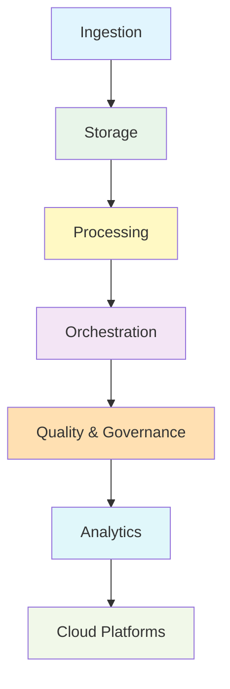

# Available Technology Stacks for Data Engineering

Data engineering relies on a broad ecosystem of tools. This document groups popular technologies by their functional area so you can choose the right stack for your project phase.

## 🌀 Data Ingestion
- **Batch**: Apache Nifi, Sqoop, AWS Glue
- **Streaming**: Apache Kafka, AWS Kinesis, Google Pub/Sub
- **API / Webhooks**: Python requests, Postman, Zapier

## 💾 Storage & Warehousing
- **Relational**: PostgreSQL, MySQL, SQL Server
- **NoSQL**: MongoDB, Cassandra, Redis
- **Data Lakes**: Hadoop HDFS, Amazon S3, Azure Data Lake Storage
- **Cloud Warehouses**: Snowflake, BigQuery, Redshift

## 🔧 Processing & Transformation
- **Batch Processing**: Apache Spark, Hadoop MapReduce
- **Stream Processing**: Apache Flink, Spark Streaming, Storm
- **ETL/ELT Tools**: Talend, Informatica, dbt
- **Scripting**: Python (Pandas), R, SQL

## 🔁 Orchestration & Automation
- **Workflow Managers**: Apache Airflow, Prefect, Luigi
- **Scheduling**: Cron, AWS Step Functions
- **CI/CD for Data**: Jenkins, GitHub Actions, GitLab CI

## ✅ Quality & Governance
- **Data Quality**: Great Expectations, Deequ
- **Data Catalogs/Lineage**: Apache Atlas, Alation
- **Governance**: Collibra, Immuta

## ☁️ Cloud Platforms & Services
- **AWS**: Glue, Lambda, Redshift, EMR
- **Azure**: Data Factory, Databricks, Synapse
- **GCP**: Dataflow, Dataproc, BigQuery

## 📊 Analytics & Reporting
- **BI Tools**: Tableau, Power BI, Looker
- **Visualization Libraries**: matplotlib, D3.js, Plotly

> Choose your stack based on data volume, latency requirements, and team expertise. Many projects combine several of these tools to meet different needs.