# Available Technology Stacks for Data Engineering

Data Engineering uses many technologies across the full data lifecycle.
These tools are usually selected based on the project stage: ingestion, storage, processing, orchestration, quality, cloud deployment, and analytics.

##  Data Ingestion

These tools are used to collect data from source systems and move it into the data platform.

### Batch Ingestion

Used when data is moved at scheduled intervals.

#### Technologies

* Apache NiFi
* Sqoop
* AWS Glue

#### Use cases

* Daily file loads
* Database-to-data-lake transfers
* Scheduled imports from business systems

### Streaming Ingestion

Used when data arrives continuously in real time.

#### Technologies

* Apache Kafka
* AWS Kinesis
* Google Pub/Sub

#### Use cases

* IoT data
* clickstream events
* payment events
* live log ingestion

### API / Webhook Ingestion

Used to collect data from applications and external services.

#### Technologies

* Python requests
* Postman
* Zapier

#### Use cases

* SaaS API integrations
* webhook event capture
* external data feed collection

* Talking point
* Ingestion is the first stage of the pipeline. Without proper ingestion, the rest of the data platform cannot function.

## Storage and Warehousing

These technologies are used to store data for applications, analytics, reporting, and large-scale processing.

### Relational Databases

Used for structured transactional and operational data.

#### Technologies

* PostgreSQL
* MySQL
* SQL Server

#### Use cases

* application databases
* master data
* structured reporting inputs

### NoSQL Databases

Used when flexibility, scale, or high-speed access is needed.

#### Technologies

* MongoDB
* Cassandra
* Redis

#### Use cases

* semi-structured data
* fast key-value access
* session or cache layers
* large distributed workloads

### Data Lakes

Used for storing raw and diverse data at scale.

#### Technologies

* Hadoop HDFS
* Amazon S3
* Azure Data Lake Storage

#### Use cases
* raw files
* logs
* images
* large-scale historical storage
* machine learning datasets

### Cloud Data Warehouses

Used for structured analytics and BI.

#### Technologies
* Snowflake
* BigQuery
* Redshift

#### Use cases
* dashboards
* business reports
* KPI analysis
* data marts

*Talking point
* Storage choice depends on the data type and business need. Not every workload should go to the same storage system.

## Processing and Transformation

These tools are used to clean, enrich, transform, aggregate, and prepare data for downstream use.

### Batch Processing

Used for scheduled large-scale transformation.

#### Technologies
* Apache Spark
* Hadoop MapReduce

#### Use cases
* daily ETL jobs
* large data transformations
* historical reprocessing

### Stream Processing

Used for continuous real-time data transformation.

#### Technologies
* Apache Flink
* Spark Streaming
* Storm

#### Use cases
* fraud detection
* live alerts
* real-time monitoring
* streaming enrichment

## ETL / ELT Tools

Used to move and transform data systematically.

#### Technologies
* Talend
* Informatica
* dbt

#### Use cases
* data warehouse pipelines
* standardized business transformations
* reusable SQL-based models

### Scripting and Query Languages

Used for flexible data manipulation and analysis.

#### Technologies

* Python with Pandas
* R
* SQL

#### Use cases
* data cleaning
* ad hoc transformation
* feature engineering
* analytical processing

**Talking point**
* Processing turns raw data into useful data. This is where data becomes meaningful for business and analytics.

## Orchestration and Automation

These tools are used to schedule, coordinate, and monitor workflows.

### Workflow Managers

Used to define end-to-end pipelines with dependencies.

#### Technologies
* Apache Airflow
* Prefect
* Luigi

#### Use cases
* scheduled ETL pipelines
* dependency management
* retry logic
* workflow monitoring

### Scheduling Tools

Used for time-based execution.

#### Technologies
* Cron
* AWS Step Functions

#### Use cases
* timed jobs
* serverless workflow triggers
* lightweight scheduling

### CI/CD for Data

Used to automate deployment and testing of data pipelines.

#### Technologies
* Jenkins
* GitHub Actions
8 GitLab CI

#### Use cases
* pipeline deployment
* automated testing
* version-controlled data workflow releases

**Talking point**
* Orchestration is like the control room of data engineering. It makes sure the right tasks run at the right time and in the right order.

## Data Quality and Governance

These tools help ensure data is trusted, traceable, secure, and compliant.

### Data Quality

Used to validate and test data.

#### Technologies
* Great Expectations
* Deequ

#### Use cases
* null checks
* schema validation
* data consistency tests
* quality monitoring

### Data Catalog and Lineage

Used to document where data comes from and how it moves.

#### Technologies
* Apache Atlas
* Alation

#### Use cases
* lineage tracking
* metadata discovery
* dataset documentation

### Governance Platforms

Used to enforce policies, privacy, and access rules.

#### Technologies
* Collibra
* Immuta

#### Use cases
* access control
* policy management
* compliance enforcement
* sensitive data governance

**Talking point**
Good data is not only available data. It must also be accurate, secure, and well-governed.

## Cloud Platforms and Services

Cloud providers offer complete ecosystems for building data platforms.

### AWS

#### Technologies
* Glue
* Lambda
* Redshift
* EMR

#### Common use
* ingestion
* transformation
* serverless processing
* warehousing

### Azure

#### Technologies
* Data Factory
* Databricks
* Synapse

#### Common use
* enterprise pipelines
* lakehouse workflows
* reporting and analytics

### GCP

#### Technologies
* Dataflow
* Dataproc
* BigQuery

#### Common use
* streaming pipelines
* Spark/Hadoop workloads
* cloud analytics

**Talking point**
* Cloud platforms provide integrated data engineering services, but each cloud has its own naming and architecture style.

## Analytics and Reporting

These tools are used to consume processed data and turn it into business insight.

### BI Tools

#### Technologies
* Tableau
* Power BI
* Looker

#### Use cases
* dashboards
* executive reports
* KPI tracking
* business self-service analytics

### Visualization Libraries
#### Technologies
* matplotlib
* D3.js
* Plotly

#### Use cases
* custom charts
* analytical notebooks
* embedded data visualizations
* web-based analytics apps

**Talking point**
Analytics tools are the final layer where business users interact with data and make decisions.

```mermaid
flowchart LR
    A[Ingestion Layer<br/>NiFi / Kafka / Glue / APIs] --> B[Storage Layer<br/>RDBMS / NoSQL / Data Lake / Warehouse]
    B --> C[Processing Layer<br/>Spark / Flink / ETL / ELT / SQL]
    C --> D[Workflow Layer<br/>Airflow / Prefect / Step Functions]
    D --> E[Data Quality & Governance<br/>Validation / Catalog / Lineage / Security]
    E --> F[Consumption Layer<br/>BI / Dashboards / Reporting / Data Science]
    F --> G[Cloud Ecosystem<br/>AWS / Azure / GCP]

    style A fill:#DDF4FF,stroke:#E5E7EB,stroke-width:1.5px,color:#111827
    style B fill:#DDF5E3,stroke:#E5E7EB,stroke-width:1.5px,color:#111827
    style C fill:#FFF4BF,stroke:#E5E7EB,stroke-width:1.5px,color:#111827
    style D fill:#EEDCF8,stroke:#E5E7EB,stroke-width:1.5px,color:#111827
    style E fill:#FFDDB8,stroke:#E5E7EB,stroke-width:1.5px,color:#111827
    style F fill:#DDF7F7,stroke:#E5E7EB,stroke-width:1.5px,color:#111827
    style G fill:#EAF5D8,stroke:#E5E7EB,stroke-width:1.5px,color:#111827

    linkStyle default stroke:#E5E7EB,stroke-width:2px
```

Choose your technology stack based on data volume, latency needs, budget, cloud environment, and team expertise. In real-world projects, organizations usually combine multiple tools rather than relying on a single technology, because different stages of the data pipeline have different requirements.